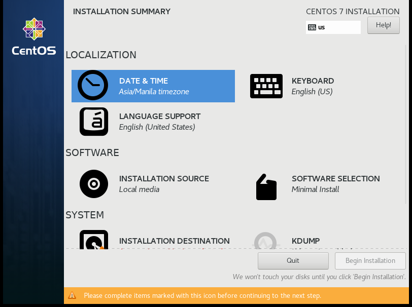
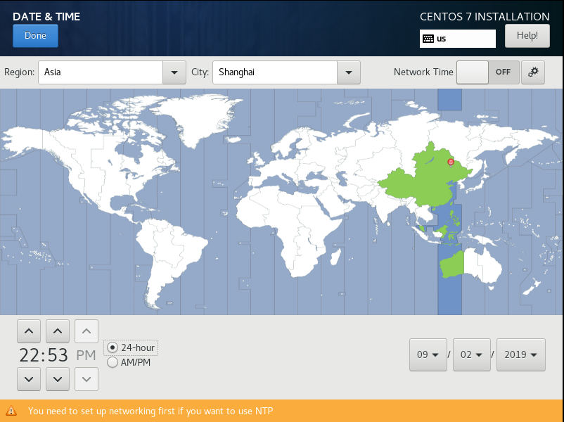
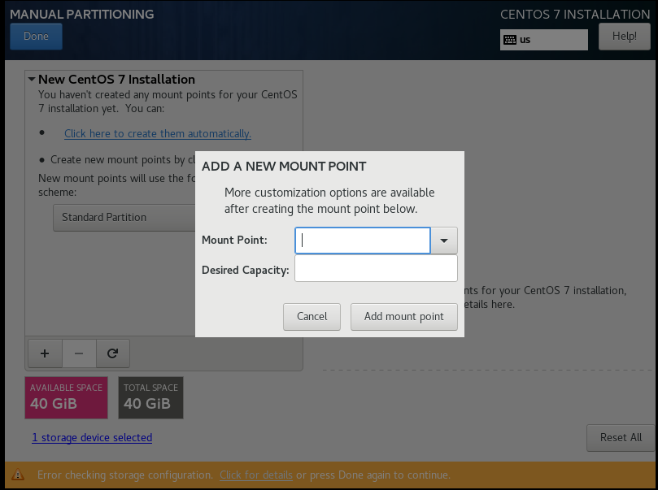
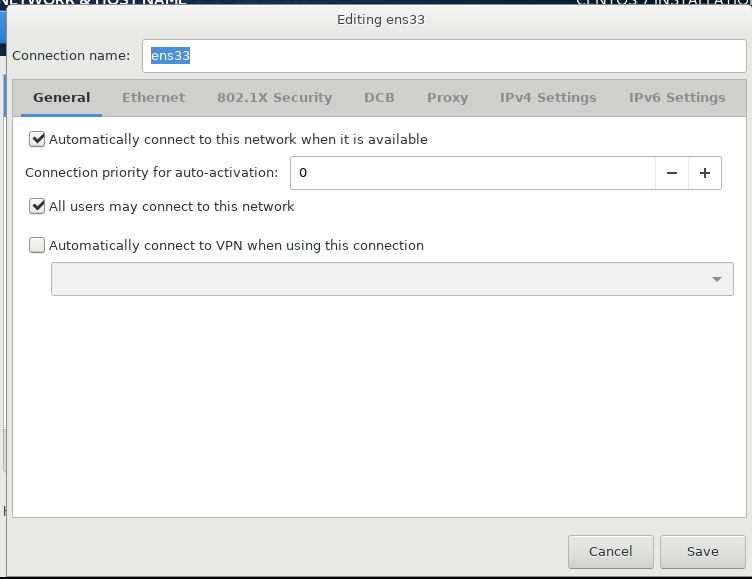
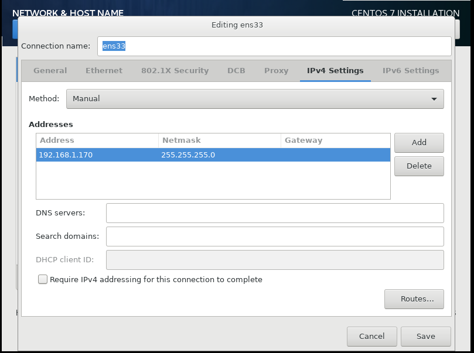

<!-- more -->

# 安装

**step 1：修改时间**





------

**step2：磁盘分区与文件系统设置**


点击`+`开始建立分区


分区的设置如下

| 分区名                           | 大小           | 设备类型            | 文件类型  |
| -------------------------------- | -------------- | ------------------- | --------- |
| Bios Boot（可选，GPT分区表可用） | 2M             | Standard  Partition | BIos Boot |
| Boot                             | 1G             | Standard  Partition | xfs       |
| /                                | 10G(FIxed 30G) | LVM                 | xfs       |
| /home                            | 5G             | Standard  Partition | xfs       |
| /swap                            | 1G             | Standard  Partition | xfs       |

需要注意的是设置`/`分区时，使用了LVM管理，其设置如下


修改完设备类型为LVM后，点击Modify按钮，进行如下设置，固定大小30G


设置完毕，确认


设备类型介绍

| 设备类型              | 描述                                                       |
| --------------------- | ---------------------------------------------------------- |
| Standard  Partition   | 类似 /dev/vda1 之类的分区                                  |
| LVM                   | 可以弹性增加/削减文件系统容量的设备设置,直接分配固定的容量 |
| LVM Thin Provisioning | LVM 的进阶版,使用多少容量才分配磁盘多少容量                |
| btrfs                 |                                                            |

文件类型介绍

| 文件类型       | 描述                                                         |
| -------------- | ------------------------------------------------------------ |
| ext2/ext3/ext4 | Linux早期适用的文件系统类型，ext3/ext4文件系统多了日志的记录, 对于系统的复原比较快速 |
| swap           | 磁盘仿真成为内存，并不会使用到目录树的挂载，所以不需要指定挂载点 |
| BIOS Boot      | GPT 分区表可能会使用到,若使用 MBR 分区则不需要               |
| xfs            | CentOS 默认的文件系统，对于大容量的磁、盘管理非常好,而且格式化的时候速度相当快。**主流** |
| vfat           | 同时被Linux与Windows所支持的文件系统类型，如果需要两个系统进行数据交换，可以创建一个vfat的文件系统 |

------

**step3：核心管理与网络设置**

点击进入`NETWORK & HOST NAME`选项

进行以下配置，开启`Ethernet`，设置`Host name`


点击`Configure`开始配置

首先开始自动连接网络



然后，手动修改网络地址



------

step4：密码设置

经过step1~3，已经配置完毕，点击安装`Centos`,在安装界面，可以对`Root`用户进行密码设定和创建新用户


至此，安装完成

# 基础入门

## 什么是指令

指令形式如下

```shell
$ command  [-opetions] parameter1 parameter2 ...
```

说明

| 字符                   | 描述                                                         |
| ---------------------- | ------------------------------------------------------------ |
| command                | 一行指令开头必定是`command`或者可执行文件                    |
| [-opetions]            | `"[]"`表示并不存在于实际指令中，通常表示为可加入选项。<br />选项前一般会加`"-"`,如`"-h"`；也有可能加`"--"`来使用选项的完整名称,如`"--help"` |
| parameter1、parameter2 | 为**依附在**选项后面的参数,或者是 `command` 的参数           |


当按下`[Enter]`键时，指令立即执行。

当指令过长时，可以在末尾使用" \ "来跳出`[Enter]`。

**在linux系统中，区分大小写**

## 基础指令

日期与时间的指令

```shell
#显示形式： 2019年 09月 02日 星期一 16:25:49 CST
$ date  
# 显示形式：2019/09/02
$ date +%Y/%m/%d
# 显示形式16:27:22
$ date +%H:%M:%S
```

------

日历的指令

```shell
# 显示本月日历
$ cal
# 显示指定年１２个月的所有日历，如cal 2014
$ cal [year]
# 显示指定年、月的日历,如cal 10 2014
$ cal [month][year]
```

------

计算器

```shell
# 可进行简单的+、－、*、/、％(余)、^(指数)
$ bc
```

------

数据同步写入硬盘中的指令

```shell
$ sync
```

因为硬盘读写速度远低于内存，所以计算机一般都是先将数据存储到内存中，等某个时机再将数据从内存保存到硬盘中。如果发生突然的不正常关机，数据没被写到硬盘中就会损失这部分数据。

该指令可以将未被存入的数据写进硬盘中。

如果是root用户，则将所有数据进行同步。如果是非root用户，只更新自己所属数据。

------

关机指令

```shell
# 执行前最好先执行 sync指令
$ shutdown [-krhc] [时间] [警告讯息]
```

可选选项

| 选项 | 描述                                                         |
| ---- | ------------------------------------------------------------ |
| -k   | 不要真的关机,只是发送警告讯息出去!                           |
| -r   | 在将系统的服务停掉之后就重新开机(常用)                       |
| -h   | 将系统的服务停掉后,立即关机。 (常用)                         |
| -c   | 取消已经在进行的 shutdown 指令内容。                         |
| 时间 | 指定系统关机的时间!时间的范例下面会说明。若没有这个项目,则默认 1 分钟后自动进行。 |

示例

```shell
# 10分钟后关机
$ shutdown -h 10 
# 系统再过十分钟后自动关机
$ shutdown -h  +10
# 取消上一次的关机指令
$ shutdown -c
# 直接关机
$ shutdown -h now
# 指定时间关机，如果当前时间晚于指定时间，则第二天的这个时候
$ shutdown -h 20:25
# 立即重启
shutdown -r now
# 仅发出警告!系统并不会关机
shutdown -k now 'This system will reboot'
```

其他关机指令（看看就好）

```shell
# 进入系统停止的模式,屏幕可能会保留一些讯息,与电源管理模式有关
$ halt
# 进入系统关机模式
$ poweroff
```


------

重启指令

```shell
# 直接重新开机, 执行前最好先执行 sync指令
$ reboot

```

------

休眠指令

```shell
# 进入休眠模式
$ suspend

```


## 基础快捷键

| 快捷键                            | 描述                                                         |
| --------------------------------- | ------------------------------------------------------------ |
| [Tab]                             | 自动补齐<br />[Tab]接在command后面，命令补全<br />[Tab]接在第二个字段后面，文件补全 |
| [Ctrl]-d                          | 键盘输入结束，即离开命令行                                   |
| [Ctrl]-c                          | 指令中断                                                     |
| [shift]+ [ PageUP ] [ Page Down ] | 向前、后翻页                                                 |

## 帮助文档

### Help

```shell
# 显示大致用法
$ command --help

```

以下是Help用法的显示数据


------

### Man page

```shell
# 显示详细的用法
$ man command

```

以下是`Man Page`用法的显示`git`指令数据


(可以通过指令`man man` 来查看显示内容代表的意义)

先来看第一行，有个`GIT(1)`，GIT就是指令，而()中的数字意义如下

| 数字          | 意义                                                         |
| ------------- | ------------------------------------------------------------ |
| **1（重要）** | 使用者在shell环境中可以操作的指令或可可执行文件              |
| 2             | 系统核心可调用的函数与工具等                                 |
| 3             | 一些常用的函数(function)与函数库(library),大部分为C的函数库(libc) |
| 4             | 设备文件的说明,通常在/dev下的文件                            |
| **5（重要）** | 配置文件或者是某些文件的格式                                 |
| 6             | 游戏(games)                                                  |
| 7             | 惯例与协定等,例如Linux文件系统、网络协定、ASCII code等等的说明 |
| **8（重要）** | 系统管理员可用的管理指令                                     |
| 9             | 跟kernel有关的文件                                           |

**标示重要的最好记住**

然后再看Man Page的内容部分，主要分为以下几个

| 代号        | 描述                                                        |
| ----------- | ----------------------------------------------------------- |
| NAME        | 简短的指令、数据名称说明                                    |
| SYNOPSIS    | 简短的指令下达语法(syntax)简介                              |
| DESCRIPTION | 较为完整的说明                                              |
| OPTIONS     | 针对 SYNOPSIS 部分中,有列举的所有可用的选项说明             |
| COMMANDS    | 当这个程序(软件)在执行的时候,可以在此程序(软件)中下达的指令 |
| FILES       | 这个程序或数据所使用或参考或链接到的某些文件                |
| SEE ALSO    | 可以参考的,跟这个指令或数据有相关的其他说明!                |
| EXAMPLE     | 一些可以参考的范例                                          |

man page 可用快捷键

| 快捷键      | 描述                                                         |
| ----------- | ------------------------------------------------------------ |
| [Page Down] | 向下翻一页                                                   |
| [Page Up]   | 向上翻一页                                                   |
| [Home]      | 去到第一页                                                   |
| [End]       | 去到最后一页                                                 |
| / string    | 向“下”搜寻 string 这个字串                                   |
| ?string     | 向“上”搜寻 string 这个字串                                   |
| n           | 如果是/ string,则继续往下查询<br />如果是?string，则继续往上查询 |
| N           | 与ｎ反向                                                     |
| q           | 结束这次的 man page                                          |

事实上，`man page`的文件存储在`/usr/share/man`目录下（一切皆文件）

如果只记得指令的部分关键字，可进行搜索`man page`

```shell
# 指令,使用-f 获取更多关于man的信息
$ man -f  man
# 结果,
$ man (1)              - 在线参考手册的接口
$ man (7)              - macros to format man pages


```

可以看到找到了两个有关man的文件，结果左边显示的是指令或文件以及它们代表的意义（那个数字），右边显示的是简要说明。而`man`指令默认会按顺序选择显示的文件，即`man man` 的话会显示`man(1)`这个文件，其与`man 1 man`效果一致。

选项`-f`匹配的是指令（显示左边部分），而如果要匹配左边和右边都行，则使用

```shell
$ man -k man
# 结果，只要左、右有一遍包含man即可
$ accessdb (8)         - 以易读的格式转储 man-db 数据库的内容
$ catman (8)           - 创建或更新预格式化的手册页
$ lexgrog (1)          - 解析 man 手册页的头部信息
$ man (1)              - 在线参考手册的接口
$ manconv (1)          - 将手册页从一种编码转换到另一种
$ mandb (8)            - 创建或更新手册页索引缓存
$ manpath (1)          - 确定手册页的搜索路径
$ manpath (5)          - 格式化 /etc/manpath.config 文件

```

### info page

info page与man page类似，主要是将内容进行分页显示，并且在各个页面中还有类似网页的“超链接”来跳到各不同的页面中。支持`info`指令的文件默认是放置`在/usr/share/info/`目录当中。**但需要查询的文档是以`Info`格式写才能使用。**

```shell
$ info command

```

# 用户相关

## 添加用户

指令

```mysql
useradd [options] LOGIN
```


可选选项

| 选项 | 描述          |
| ---- | ------------- |
| u    | 指定uid       |
| g    | 指定主组      |
| d    | 指定家目录    |
| c    | 添加秒速信息  |
| s    | 指定shell信息 |
| G    | 指定附加组    |


示例

```
useradd -u 1024 -g root -d /test_user/ -c 'test' -s /bin/bash test_user
```


## 删除用户

指令

```
userdel [options] LOGIN
```


选项

| 选项 | 描述               |
| ---- | ------------------ |
| r    | 删除主目录和邮件池 |


示例

```
userdel -r famel
```


## 修改用户

指令

```
usermod [options] LOGIN
```


选项

| 选项 | 描述 |
| ---- | ---- |
|      |      |

## 修改用户密码

指令

```
  passwd  [-k]  [-l]  [-u  [-f]]  [-d] [-e] [-n mindays] [-x liisyudays] [-w warndays] [-i inactivedays] [-S] [--stdin] [username]
```


选项

| 选项  | 描述                                                         |
| ----- | ------------------------------------------------------------ |
| stdin | 允许接受参数作为密码(centos使用) 一次性修改密码方法<br /> `echo 123456 &#124; passwd --stdin famel` |


示例

```java
//修改root用户密码
sudo passwd
// 修改当前用户密码
passwd 
// 修改指定用户密码
passwd liisyu
```


## 查看用户信息

指令

```
id [OPTION]... [USER]
```


选项

| 选项 | 描述 |
| ---- | ---- |
|      |      |


示例

```java
//查看指定用户信息
id liisyu
```


## 查看所有用户登录情况

指令

```
who [OPTION]... [ FILE | ARG1 ARG2 ]
```


示例

```java
//查看所有用户登录信息
who
```


## 查看当前用户登录情况

指令

```
tty
```


示例

```java
//查看当前用户登录情况
tty
```


## 查看当前用户名

指令

```
whoami
```


示例

```java
//查看当前用户名
whoami
```


## 切换用户

指令

```
su [options...] [-] [user [args...]]
```


示例

```java
//切换用户
su - liisyu
```


## 退出用户

指令

```
exit
```


## 模拟用户的创建过程

第一步：添加新用户信息

```java
vim /etc/passwd

//加入以下信息
liisyu:x:1024:1024:liisyu,,,:/home/liisyu:/bin/bash
```


第二步：为新用户添加家目录

```
mkdir /home/liisyu
```


第三步：为新用户添加密码

```java
vim /etc/shadow

//加入以下信息
liisyu:*:17855:0:99999:7:::
```


第四步：为新用户添加主组

```java
vim /etc/group

//加入以下信息
liisyu:x:1024:
```


第五步：为组添加组密码

```java
vim /etc/gshadow

//加入以下信息
liisyu:!::
```


第六步：为用户创建邮箱

```java
touch /var/spool/mail/liisyu
```


第七步： 为创建的邮箱未见属主和属组改为liisyu

```java
chown -R liisyu.liisyu /var/spool/mail/liisyu 
```


第八步：把相关文件复制到家目录下

```
cp /etc/skel/.[!.]* /home/liisyu
```


第九步：将复制的文件属主和属组改为liisyu'

```
chown -R liisyu.liisyu /home/liisyu
```


第十步：为用户加个密码

```
passwd liisyu
```


# 组相关

## 添加组

指令

```java
groupadd [options] group
```


示例

```java
groupadd anewgroup
```


## 删除组

指令

```
groupdel [options] GROUP
```


示例

```
groupdel anewgroup
```


## 修改组

指令

```
groupmod [options] GROUP
```


可选选项

| 选项 | 描述     |
| ---- | -------- |
| n    | 修改组名 |
| g    | 修改组id |


示例

```java
// 修改组名
groupmod -n new_name old_name

// 修改组id
grioupmod -g 1032 goup_1
```


# 权限相关

linux文件一般有三个身份：`owner`、`group`、`others`，以及三种权限 `read`、`write`、`execute` 

## 权限相关文件

| 文件路径     | 描述                                                   |
| ------------ | ------------------------------------------------------ |
| /etc/passwd  | 系统帐号、一般身份使用者、root相关信息均保存在此文件中 |
| /etc/shadow  | 个人密码                                               |
| /etc/group   | 群组信息                                               |
| /etc/gshadow | 群组密码                                               |

### passwd文件

用户信息文件，位于 `/etc/passwd`


以```famel:x:1000:1000:Famel,,,:/home/famel:/bin/bash```为例
第一段：```famel```,用户名
第二段：```x```,密码的占位符
第三段：```1000```,uid
第四段：```1000```,gid
第五段：```Famel,,,```,用户描述信息
第六段：```/home/famel```,用户家目录
第七段：shell命令
```/bin/bash```: 用户登录shell（可登录）
```/sbin/nologin```: 用户不可登录（ftp可登录）
```/bin/false```: 一切服务均不可登录，最严格


### shadow文件

(用户密码文件)文件，位于 `/ect/shadow` 


以如下行为例```famel:$6$7Xe...:17855:0:99999:7:::```
第一段：```famel```,用户名
第二段：```$6$7Xe...```,加密后的密码
第三段：```17855```
第四段：```0```
第五段：```99999```
第六段：```7```

### group文件

组文件，位于： `/etc/group`


以```famel:X:1000:```为例
第一段：```famel```,组名
第二段：```x```,组密码占位符
第三段：```1000```,组id
第四段：组员(famel 用户肯定在famel，所以这里是空的)，这里表示的是附加组

### gshadow文件

组密码文件,位于 `/etc/gshadow`


## 阅读权限

指令

```shell
# 查看当前目录下文件的权限
$ ll
# 查看当前目录下文件的权限，完整的时间
$ls -l --full-time 
#  查看当前目录的权限
$ ls -dl 
```

示例

```shell
$ ls -dl /home/famel
# 结果
$ d rwx r-x r-x 16 famel famel 4096 11月 21 13:45 /home/famel
```

结果分析：

第一段：文件类型
```d```，表示目录
```-```，普通文件
```l```，快捷方式
```p```，管道文件(FIFO,pipe)，用于解决多个程序同时存取一个文件所造成的错误问题
```c```，字符设备，如键盘
```b```，磁盘文件，如`/dev/sda`就是一个磁盘文件
```s```, 数据接口文件,通常被用在网络上的数据承接,在`/run`或`/tmp`等目录中截图看到这种文件类型
第二段：```rwx```，属主的权限
第三段：```r-x```，属组的权限
第四段：```r-x```，除属主和属组之外的其他用户权限rw
第五段：`"16"`，表示有多少文件名链接到此节点(i-node)
第六段：```famel```，属主
第七段：```famel```，属组
第八段：```4096```，已经占用大小，默认单位Bytes
第九段：`" 11月 21 13:45"`,创建日期或者是最近的修改日期
第十段：`"/home/famel"`,文件名

## 修改权限

指令

```shell
$  chmod [-OPTION]
```

选项

| 选项 | 描述     |
| ---- | -------- |
| u    | 属主     |
| g    | 属组     |
| o    | 其他用户 |

示例

```java
//将a.txt的rw权限赋给属主
chmod u=rw a.txt
//删除属组的read权限
chmod g-r a.txt
//属主权限rwx,属组权限rwx,其他用户权限r
chmod 774 a.txt
//修改多个，o=表示无任何权限
chomd  u=rw,g=rwx,o= a.txt
//对当前目录下所有的文件夹权限开放
chmod 777 *
```

权限相关概念

| 字母 | 描述                  | 对于文件 | 对于目录                                   |
| ---- | --------------------- | -------- | ------------------------------------------ |
| r    | 对应数字4，可读权限   | 能看内容 | 浏览目录下的子目录名，子文件名             |
| w    | 对应数字2，可写权限   | 修改内容 | 创建，重命名，删除、移动子目录名、子文件名 |
| x    | 对应数字1，可执行权限 | 执行文件 | 可以cd切换进入                             |

此外：

1. 对于需要删除某一目录下的文件，需要`wx`权限
2. 想要执行文件，需要`rx`权限

## 修改拥有者

指令

```shell
# -R选项：目录下的所有次目录或文件同时更改文件拥有者
#更改拥有者
$ chown [ -R ]  账号名称   文件名 | 目录名
#　更改拥有者与群组
$ chown  [ -R ] 账号名称: 群组名称  文件名 | 目录名
```

示例

```shell
# 将 initial-setup-ks.cfg 的拥有者改为bin这个帐号
$ chown bin initial-setup-ks.cfg
# 将 initial-setup-ks.cfg 的拥有者与群组改为root
$  chown root:root initial-setup-ks.cfg
```

## 修改文件所属群组

指令

```shell
# -R选项：目录下的所有次目录或文件同时更改文件拥有者
#更改属组
$ chgrp [ -R ]  账号名称   文件名 | 目录名
```


## 实际操作：为LINUX用户添加sudo操作权限

第一步：进入root

```
su - root
```


第二步:修改```sudoers```文件

``````java
vim /etc/sudoers

//找到该行
## Allow root to run any commands anywhere 
root    ALL=(ALL)       ALL
``````


第三步：添加

```java
//为单个用户添加sudo操作，需要输入密码
liisyu    ALL=(ALL)   ALL
//为单个用户添加sudo操作，不需要输入密码
liisyu    ALL=(ALL)   NOPASSWD: ALL
//为用户组添加sudo操作，需要输入密码
%mygroup  ALL=(ALL)   ALL
//为用户组添加sudo操作，不需要输入密码
%mygroup  ALL=(ALL)   NOPASSWD: ALL
```


# 系统相关


## 查看网络信息

```
netstat -tunalp
```


## 实时系统信息

按`1`可以展开CPU

```java
top

//输出如下
top - 21:56:49 up(开机时间)  2:48（运行时间）,  3 users（使用人数）,  load average: 0.00, 0.00, 0.00（平均负载：1分钟，5分钟，15分钟）
Tasks（任务）: 157 total（当前任务）,   1 running（正在运行的任务）, 156 sleeping,   0 stopped（等待）,（暂停）   0 zombie（僵尸进程）
Cpu(s):  0.0%us,  0.3%sy,  0.0%ni, 99.7%id,  0.0%wa,  0.0%hi,  0.0%si,  0.0%st
Mem（内存）:   1003020k total,   852632k used,   150388k free,    72608k buffers
Swap:  2097148k total,        0k used,  2097148k free,   472880k cached

   PID USER      PR  NI  VIRT  RES  SHR S %CPU %MEM    TIME+  COMMAND                                                                                                  
     1 root      20   0 19344 1572 1244 S  0.0  0.2   0:01.60 init                                                                                                      
     2 root      20   0     0    0    0 S  0.0  0.0   0:00.00 kthreadd                                                                                                  
     3 root      RT   0     0    0    0 S  0.0  0.0   0:00.00 migration/0                                                                                               
     4 root      20   0     0    0    0 S  0.0  0.0   0:00.00 ksoftirqd/0                                                                                               
     5 root      RT   0     0    0    0 S  0.0  0.0   0:00.00 stopper/0                                                                                                 
     6 root      RT   0     0    0    0 S  0.0  0.0   0:00.01 watchdog/0                                                                                                
     7 root      20   0     0    0    0 S  0.0  0.0   0:05.11 events/0     
```

  

## 查看cpu信息

```java
// cpu信息保存在/proc/cpuinfo文件中
cat /proc/cpuinfo
```


## 查看指令路径

指令

```
which [options] [--] programname [...]
```


示例

```java
//查看ls指令的路径
which ls
```


### 命令的执行过程

以`ls`为例，解释命令是如何执行的
1. 首先需知道，执行```ls```命令，相当于执行`/bin/ls`,这两个操作时一样的
2. 可以通过`which ls`来查看命令的路径
```linux
[root@famel Packages]# which ls
alias ls='ls --color=auto'
	/bin/ls
```
3. 当执行`ls`命令时，该命令会传给`shell`
4. `shell`会从`PAHT`环境变量查找
5. 通过`echo $PATH`,可以查看环境变量的值
```linux
[root@famel Packages]# echo $PATH
/usr/lib64/qt-3.3/bin:/usr/local/sbin:/usr/local/bin:/sbin:/bin:/usr/sbin:/usr/bin:/root/bin
```
6. 在桌面模式执行时，会发现`ls`查看的文件有颜色，而`/bin/ls`没有颜色。此时再看`which ls`的查询信息
`alias ls='ls --color=auto'`: 别名，也就说当ls执行时，其实执行的是`ls --color=auto`
也就是说`ls`真正等同于 `/bin/ls --color=auto`


## 别名

```java
//执行`test`命令时,就相当于执行了`ll /dev`
alias test='ll /dev'
```


## 关机

```
init 0
```

## 立即关机
```
shutdown -h now
```
## 重启
```
init 6
```

## 多用户终端切换
```
ctrl + alt + f1~f6(文本界面) \F7 (图形界面)
```

##  查看日期
```
date
```

## 查看日历
```
cal
```

+ 年: 查看某年的日历，如`cal 1990`
+ 月 年:查看某年的某月的日历,如`cal 3 1998`


## 帮助文档
```
指令 --help
man 指令
```
## 分页查看（上下）
```java
//通过键盘上下键翻阅
ls --help | less
```
## 百分比查看

```java
//百分比查看信息,通过回车翻页
ls --help | more
```


## 历史

查看历史

```
history
```
使用历史

```
! 历史编号
```


查看系统内核信息

```java
uname -a

//输出如下
Linux famel-virtual-machine  主机名
4.4.0-21-generic #37-Ubuntu 
SMP Mon Apr 18 18:33:37 UTC 2016 时间
 x86_64 x86_64 x86_64 GNU/Linux
```


# 文件与目录相关

## FHS标准

FHS（Filesystem Hierarchy Standard）标准，重点在于规范每个特定的目录下应该要放置什么样子的数据。

代表性的目录

|                        | 可分享(shareable)         | 不可分享(unshareable) |
| ---------------------- | ------------------------- | --------------------- |
| **不变的(static)**     | 软件放置处(/usr)          | 配置文件(/etc)        |
|                        | 第三方协力软件(/opt)      | 开机与核心档(/boot)   |
| **可变动的(variable)** | 使用者邮件信箱(/var/mail) | 程序相关(/var/run)    |
|                        | 新闻群组(/var/spool/news) | 程序相关(/var/lock)   |

类型解释

| 类型       | 描述                                                         |
| ---------- | ------------------------------------------------------------ |
| 可分享的   | 可以分享给其他系统挂载使用的目录                             |
| 不可分享的 | 运行的设备文件或者是与程序有关的socket文件等,仅与自身机器有关 |
| 不变的     | 数据不经常变动，如函数库、文件说明文档、系统管理员所管理的主机服务配置文件等 |
| 可变动的   | 经常改变的数据,例如登录文件、一般用户可自行收受的新闻群组等  |

三层目录定义，每个目录下放置的目录也有特别的规定。

| 目录                            | 描述                |
| ------------------------------- | ------------------- |
| 根目录( / )                     | 与开机系统有关      |
| unix software resource( / usr ) | 与软件安装/执行有关 |
| variable (/ var)                | 与系统运行过程有关  |

### 根目录

根目录是整个系统最重要的一个目录，与开机/还原/系统修复等动作有关。根目录(/)所在分区应该越小越好, 且应用程序所安装的软件最好不要与根目录放在同一个分区内。

以下目录建议全部存在，哪怕没有实体目录，也至少有个链接文件在

| 目录   | 描述                                                         |
| ------ | ------------------------------------------------------------ |
| /bin   | 在/bin下面的指令可以被root与一般帐号所使用,主要有:cat,chmod, chown, date, mv, mkdir, cp, bash等等常用的指令 |
| /boot  | 放置开机会使用到的文件,包括Linux核心文件以及开机菜单与开机所需配置文件等等 |
| /dev   | 任何设备与周边设备都是以文件的型态存在于这个目录             |
| /etc   | 系统主要的配置文件几乎都放置在目录内                         |
| /lib   | 放置在开机时会用到的函数库，以及在/bin或/sbin下面的指令会调用的函数库 |
| /media | 放置可移除的设备，包括软盘、光盘、DVD等等设备都暂时挂载于此  |
| /mnt   | 暂时挂载某些额外的设备                                       |
| /opt   | 放置第三方协力软件目录(在早期习惯放在/usr/local)             |
| /run   | 放置系统开机后所产生的各项信息                               |
| /sbin  | 放置开机过程中用来设置系统环境的指令，包括开机、修复、还原系统等指令 |
| /srv   | 可以视为“service”的缩写，网络服务启动之后所需要取用的数据目录(默认还是建议放置到 /var/lib 下面即可) |
| /tmp   | 临时存放文件目录，建议定期清理                               |
| /usr   | 第二层 FHS 设置                                              |
| /var   | 第二曾 FHS 设置                                              |

以下目录为FHS建议的目录

| 目录         | 描述                                                         |
| ------------ | ------------------------------------------------------------ |
| /home        | 系统默认的使用者主文件夹，如/home/liisyu                     |
| /lib< qual > | 用来存放与 /lib 不同的格式的二进制函数库,例如支持 64 位的 /lib64 函数库等 |
| /root        | 系统管理员(root)的主文件夹                                   |

以下目录了解

| 目录        | 描述                                                         |
| ----------- | ------------------------------------------------------------ |
| /lost+found | 使用标准的ext2/ext3/ext4文件系统格式才会产生的一个目录,当文件系统发生错误时, 一些遗失的片段会放置到这个目录下 |
| /proc       | 目录本身是一个“虚拟文件系统(virtual filesystem)”，放置的数据都是在内存当中, 例如系统核心、行程信息(process)、周边设备的状态及网络状态等等（所以不占用硬盘空间） |
| /sys        | 与/proc类似,也是一个虚拟的文件系统，记录核心与系统硬件信息较相关的信息，包括目前已载入的核心模块与核心侦测到的硬件设备信息等等 |

### usr目录

/usr里面放置的数据属于可分享的与不可变动的。**usr并不是user的缩写，而是Unix Software Resource（Unix操作系统软件资源）**。所有系统默认的软件都会放置到该目录下，相当于windows系统的Windows和Program files。**建议不要在该目录下自行为软件创建目录**。

在linux安装时会占用大量硬盘容量。

以下目录建议全部存在，哪怕没有实体目录，也至少有个链接文件在

| 目录        | 描述                                                         |
| ----------- | ------------------------------------------------------------ |
| /usr/bin/   | 放置所有一般用户能够使用的指令（Centos7已经使用链接文件的方式将全部的使用者指令放置于此，即/usr/bin 与 /bin是一模一样）<br />FHS建议该目录下没有子目录 |
| /usr/lib/   | /lib 链接到此目录中，所以该目录与/lib目录一样                |
| /usr/local/ | 放置本机自行安装下载的软件                                   |
| /usr/sbin/  | 非系统正常运行所需要的系统指令，/sbin 链接到此目录中         |
| /usr/share/ | 放置只读架构的数据文件,包括共享文件。该目录下几乎都是文字文件，如线上说明文档 /usr/share/man，软件杂项的文件说明 /usr/share/doc... |

以下目录为FHS建议的目录

| 目录              | 描述                                                         |
| ----------------- | ------------------------------------------------------------ |
| /usr/games/       | 与游戏相关的数据放置处                                       |
| /usr/include/     | c/c++等程序语言的文件开始(header)与包含档(include)放置处     |
| /usr/libexec/     | 放置一般不会被使用者惯用的可执行文件或脚本                   |
| /usr/lib< qual >/ | 与 /lib< qual >/功能相同, /lib<qual> 就是链接到此目录中      |
| /usr/src/         | 一般源代码建议放置到这里（核心源代码建议放置到/usr/src/linux/目录下） |

### var目录

在系统运行后才会渐渐占用硬盘容量的目录，主要针对常态性变动的文件,包括高速缓存(cache)、登录文件(log file)以及某些软件运行所产生的文件, 包括程序文件(lock file, run file),或者例如MySQL数据库的文件等

以下目录建议全部存在，哪怕没有实体目录，也至少有个链接文件在

| 目录        | 描述                                                         |
| ----------- | ------------------------------------------------------------ |
| /var/cache/ | 应用程序本身运行过程中会产生的一些暂存盘                     |
| /var/lib/   | 程序本身执行的过程中,需要使用到的数据文件放置的目录。此目录下各自的软件应该要有各自的目录，如MySQL的数据库放置到/var/lib/mysql/ |
| /var/lock/  | 设备上锁(lock),以确保该设备只会给单一软件所使用(**Centos7 已经移动到了/run/lock**) |
| /var/log/   | 登录文件放置的目录,**重要**，如/var/log/wtmp(记录登陆者的信息) |
| /var/mail   | 放置个人电子邮件信箱的目录，并且该目录还存在与/var/spool/mail/，两者为互为链接文件 |
| /var/run/   | 某些程序或者是服务启动后,放置其PID到此目录，目录链接到 /run目录中 |
| /var/spool/ | 放置伫列数据<br />伫列数据：排队等待其他程序使用的数据       |

### 目录树图片


## 目录相关

进入目录,需要x权限

```shell
# 进入目录
$ cd /a/b
# 进入上级目录
$ cd ..
# 进入上次所在的目录
$ cd -
#进入用户家目录
$ cd ~
# 进入account 这个用户的家目录,即/home/account
$ cd ~account
# 进入根目录
$ cd /
```

---

显示当前所在目录

```shell
$ pwd
# 显示真实的路径，而非链接路径。如/var/mail链接了/var/spool/mail，在前者目录下使用该指令显示的是后者
$ pwd -P
```
选项

| 选项 | 描述                         |
| ---- | ---------------------------- |
| P    | 显示真实的路径，而非链接路径 |

---

创建目录

```shell
$ mkdir [-mp] 目录名称
```


选项

| 选项 | 描述                                   |
| ---- | -------------------------------------- |
| p    | 递归添加目录(即创建多层目录也不会报错) |
| m    | 设置文件的权限                         |

示例

```shell
# 创建test2目录，并设置权限为rwx--x--x
$ mkdir -m 711 test2
```


---

删除空目录(**只能删除空的目录！**)

```shell
$ rmdir [-p] 目录名称
```

选项

| 选项 | 描述                             |
| ---- | -------------------------------- |
| p    | 连同“下层”“空的”目录也一起删除。 |

示例

```shell
# 假设有四个空目录，结构为/test1/test2/test3/test4
#直接删除test1，因为其内还有3个空目录，删除失败
$ rmdir  /test1
$ rmdir: failed to remove ‘test1’: Directory not empty
# 加上-P后成功删除
$ rmdir  -P /test1
```

---

查看当前所在目录

```shell
$ pwd
```

## 文件相关

### Linux文件扩展名

linux是没有扩展名一说的，如一个文件，决定能不能执行是看它的内容以及权限，但仍然存在一些特定的扩展名，便于了解该文件是什么。

| 扩展名                        | 描述                       |
| ----------------------------- | -------------------------- |
| *.sh                          | 脚本或批处理文件 (scripts) |
| Z, .tar, .tar.gz, .zip, *.tgz | 经过打包的压缩文件         |
| .html, .php                   | 网页相关文件               |

### Linux文件限制

文件名长度限制

使用Ext2/Ext3/Ext4/xfs文件系统文件名长度限制为：单一文件或目录的最大容许文件名为 255Bytes

------

文件名称限制

避免特殊字符：`?  >  <  ;  &  !  [  ]  |  \  '  " ` ( ) { }`

------

### 相关指令

**新建文件或修改文件创建时间**

```shell
$ touch [-acdmt] 文件
```

选项

| 选项 | 描述                                                         |
| ---- | ------------------------------------------------------------ |
| -a   | 仅修订 access time;                                          |
| -c   | 仅修改文件的时间,若该文件不存在则不创建新文件;               |
| -d   | 后面可以接欲修订的日期而不用目前的日期,也可以使用 --date="日期或时间" |
| -m   | 仅修改 mtime ;                                               |
| -t   | 后面可以接欲修订的时间而不用目前的时间,格式为[YYYYMMDDhhmm]  |

 linux的三个时间

1. `modification time (mtime)`：该文件的“内容数据”变更时,就会更新这个时间
2. `status time (ctime)`：当该文件的“状态 (status)”改变时,就会更新这个时间（如属性、权限等被改变）
3. `access time (atime)`：当“该文件的内容被取用”时,就会更新这个读取时间（如使用cat 访问这个时间）

---

**直接查看文件内容**

```shell
$ cat [-AbEnTv]
# 反向输出，连指令名都是的反向
$ tac [-AbEnTv]
```

选项

| 选项 | 描述                                                     |
| ---- | -------------------------------------------------------- |
| -A   | 相当于 -vET 的整合选项,可列出一些特殊字符而不是空白而已; |
| -b   | 列出行号,仅针对非空白行做行号显示,空白行不标行号!        |
| -E   | 将结尾的断行字符 $ 显示出来;                             |
| -n   | 打印出行号,连同空白行也会有行号,与 -b 的选项不同;        |
| -T   | 将 [tab] 按键以 ^I 显示出来;                             |
| -v   | 列出一些看不出来的特殊字符                               |

 **查看文件内容，并添加行号打印**

```shell
$ nl [-bnw] 文件
```

选项

| 选项            | 描述                                                         |
| --------------- | ------------------------------------------------------------ |
| -b [a,b]        | 指定行号的显示方式<br />a: 表示不论是否为空行,也同样列出行号<br />b: 如果有空行,空的那一行不要列出行号(默认) |
| -n [ln, rn, rz] | 列出行号表示的方法<br />ln: 行号在屏幕的最左方显示<br />rn :行号在自己字段的最右方显示,且不加 0<br />rz :行号在自己字段的最右方显示,且加 0 ; |
| -w              | 行号字段的占用的字符数                                       |

示例

```shell
$ nl -b a /etc/issue
# 显示结果
1 \S
2 Kernel \r on an \m
3

$ nl -b a -n rz /etc/issue
# 显示结果
000001 \S
000002 Kernel \r on an \m
000003

$ nl -b a -n rz -w 3 /etc/issue
# 显示结果
001 \S
002 Kernel \r on an \m
003
```

---

**翻页查看**

```shell
$ more {文件}
$ less {文件}
```

less 可用按钮(事实上man page就是调用了less)

| 快捷键      | 描述                                                         |
| ----------- | ------------------------------------------------------------ |
| [Page Down] | 向下翻一页                                                   |
| [Page Up]   | 向上翻一页                                                   |
| [Home]      | 去到第一页                                                   |
| [End]       | 去到最后一页                                                 |
| / string    | 向“下”搜寻 string 这个字串                                   |
| ?string     | 向“上”搜寻 string 这个字串                                   |
| n           | 如果是/ string,则继续往下查询<br />如果是?string，则继续往上查询 |
| N           | 与ｎ反向                                                     |
| q           | 结束这次的 man page                                          |
| g           | 前进到这个数据的第一行去;                                    |
| G           | 前进到这个数据的最后一行去 (注意大小写);                     |

---

**查看文件头部**

```shell
$ head [-n number] 文件
```

选项

| 选项 | 描述                          |
| ---- | ----------------------------- |
| -n   | 后面接数字,代表显示几行的意思 |

---

**查看文件尾部**

```shell
$ tail [-n number] 文件
```

选项

| 选项 | 描述                                                         |
| ---- | ------------------------------------------------------------ |
| -n   | 后面接数字,代表显示几行的意思                                |
| -f   | 示持续侦测后面所接的文件名,要等到按下[ctrl]-c才会结束tail的侦测(如查看日志时使用) |

------

**非纯文本查看**

所谓的非纯文本，比如说可执行文件，源代码等，如果使用上面的指令，可能会出现乱码

```shell
$ od [-t TYPE] 文件
```

Type类型

| 类型    | 描述                                                         |
| ------- | ------------------------------------------------------------ |
| a       | 利用默认的字符来输出;                                        |
| c       | 使用 ASCII 字符来输出                                        |
| d[size] | 利用十进制(decimal)来输出数据,每个整数占用 size Bytes ;      |
| f[size] | 利用浮点数值(floating)来输出数据,每个数占用 size Bytes ;     |
| o[size] | 利用八进位(octal)来输出数据,每个整数占用 size Bytes ;        |
| x[size] | 利用十六进制(hexadecimal)来输出数据,每个整数占用 size Bytes ; |

---

文件数据类型查看

指令

```shell
$ file
```

示例

```shell
$ file ~/.bashrc
# 结果， 为ASCII的纯文本文件
/root/.bashrc: ASCII text

$  file /usr/bin/passwd
# 结果，可执行文件（数据多），显示的内容包括文件的 suid 权限、相容于 Intel x86-64 等级的硬件平台，使用的是 Linux 核心3.2.0 的动态函数库链接等
/usr/bin/passwd: setuid ELF 64-bit LSB shared object, x86-64, version 1 (SYSV), dynamically linked, interpreter /lib64/l, for GNU/Linux 3.2.0, BuildID[sha1]=7842b6fc0e39aceb47814351fc187ef18fa8e14a, stripped
```


## 目录和文件管理

**查看指令**

```shell
$ ls [-aAdfFhilnrRSt] 文件名或目录名称
$ ls [--color={never,auto,always}] 文件名或目录名称
$ ls [--full-time] 文件名或目录名称
#ls -l 的简写，因为很常用
$ ll
```
选项
| 选项                         | 描述                                                         |
| ---------------------------- | ------------------------------------------------------------ |
| -a                           | 全部的文件,连同隐藏文件( 开头为 . 的文件) 一起列出来**(常用)** |
| -A                           | 全部的文件,连同隐藏文件,但不包括 . 与 .. 这两个目录          |
| -d                           | 仅列出目录本身,而不是列出目录内的文件数据(常用)              |
| -f                           | 直接列出结果,而不进行排序 (ls 默认会以文件名排序!)           |
| -F                           | 根据文件、目录等信息,给予附加数据结构,例如:<br/>`*`代表可可执行文件; `/`代表目录; `=`代表 socket 文件; &#124;代表 FIFO 文件; |
| -h                           | 将文件大小以人类较易读的方式(例如 GB, KB 等等)列出来;        |
| -i                           | 列出 inode 号码                                              |
| -l                           | 长数据串行出,包含文件的属性与权限等等数据;**(常用)**         |
| -n                           | 列出 UID 与 GID 而非使用者与群组的名称                       |
| -r                           | 将排序结果反向输出,例如:原本文件名由小到大,反向则为由大到小; |
| -R                           | 连同子目录内容一起列出来,等于该目录下的所有文件都会显示出来; |
| -S                           | 以文件大小大小排序,而不是用文件名排序;                       |
| -t                           | 依时间排序,而不是用文件名。                                  |
| --color=[never, always,auto] | never :不要依据文件特性给予颜色显示;<br/>always :显示颜色<br/>auto:让系统自行依据设置来判断是否给予颜色 |
| --full-time                  | 以完整时间模式 (包含年、月、日、时、分) 输出                 |
| --time=[atime,ctime]         | 输出 access 时间或改变权限属性时间 (ctime)而非内容变更时间 (modification time) |

示例

```shell
# 显示文件mtime
$ ls -l /etc/man_db.conf ;
# 显示文件atime
$ ls -l --time=atime /etc/man_db.conf 
# 显示文件ctime
$ ls -l --time=ctime /etc/man_db.conf
```


---

**复制指令**

```shell
# source：来源文件，ｄｅstination：目标文件,directory：文件夹
$ cp [-adfilprsu] source destination
# 多源放到文件夹中
$ cp  [options] source1 source2 source3 .... directory
```

选项

| 选项           | 描述                                                         |
| -------------- | ------------------------------------------------------------ |
| -a             | 相当于 -dr --preserve=all 的意思**(常用)**                   |
| -d             | 若来源文件为链接文件的属性(link file),则复制链接文件属性而非文件本身; |
| -f             | 为强制(force)的意思,若目标文件已经存在且无法打开,则移除后再尝试一次; |
| -i             | 若目标文件(destination)已经存在时,在覆盖时会先询问动作的进行**(常用)** |
| -l             | 进行硬式链接(hard link)的链接文件创建,而非复制文件本身;      |
| -p             | 连同文件的属性(权限、用户、时间)一起复制过去,而非使用默认属性**(备份常用)**; |
| -r             | 递回持续复制,用于目录的复制行为;**(常用)**                   |
| -s             | 复制成为符号链接文件 (symbolic link),即“捷径”文件;           |
| -u             | destination 比 source 旧才更新 destination,或 destination 不存在的情况下才复制。 |
| --preserve=all | 除了 -p 的权限相关参数外,还加入 SELinux 的属性, links, xattr 等也复制了。<br/>最后需要注意的,如果来源文件有两个以上,则最后一个目的文件一定要是“目录”才行! |

复制对于不同的身份，指令结果会不同（尤其是-a、-p选项）。

cp指令在不加状态的情况下，文件的某些属性/权限会改变。

```shell
# 以下cp是以root用户的身份操作

$ cp /var/log/wtmp .
# 结果，可以看到两个文件的属性并不完全一致。
$ -rw-rw-r--. 1 root utmp 28416 Jun 11 18:56 /var/log/wtmp
$ -rw-r--r--. 1 root root 28416 Jun 11 19:01 wtmp
# 想要完全一致，则使用-a选项
$ cp -a /var/log/wtmp wtmp_2
#  结果
$ -rw-rw-r--. 1 root utmp 28416 Jun 11 18:56 /var/log/wtmp
$ -rw-rw-r--. 1 root utmp 28416 Jun 11 18:56 wtmp_2
# -l: 复制实体链接，-s复制符号链接
$ cp -s bashrc bashrc_slink
$ cp -l bashrc bashrc_hlink
# 结果，实体链接一致，而符号链接就相当于一个快捷方式
$  -rw-r--r--. 2 root root 176 Jun 11 19:01 bashrc
$ -rw-r--r--. 2 root root 176 Jun 11 19:01 bashrc_hlink
$ lrwxrwxrwx. 1 root root 6 Jun 11 19:06 bashrc_slink -> bashrc
```

linux默认的目标文件拥有者是指令操作者，所以cp之后权限、属主、属组等均发生了变化。但如果指令操作者权限不够的话，也有可能无法更改权限、属主、属组等。

另外需要注意的是，**在cp特殊权限文件要格外注意，如密码档(/etc/shadow)，必须要加上-a或-p选项。**

综上，复制一个文件时，应该考虑以下几点

1. 是否需要完整的保留来源文件的信息
2. 来源文件是否为链接文件
3. 来源文件是否为特殊的文件
4. 来源文件是否为目录


---

**删除指令**,需要wx权限

```shell
$ rm [-fir] 文件或目录
```

选项

| 选项 | 描述                                                 |
| ---- | ---------------------------------------------------- |
| -f   | force 强制的意思，忽略不存在的文件,不会出现警告讯息; |
| -i   | 互动模式,在删除前会询问使用者是否动作                |
| -r   | 递回删除!!非常危险的选项!!!**                        |

示例

```shell
# 删除所有bashrc开头的文件
$ rm -i bashrc*
#　删除"-"开头的文件,错误方式：rm -aaa-,　"-"是选项，系统会误判
rm ./-aaa-
rm -- -aaa-
```

**不推荐直接使用rm来删除目录，而是用以下方式**

```shell
# 将需要删除的目录移动到tmp文件夹，这样可以找回
$ mv /a/b/ /tmp
```

---

**移动指令**

```shell
$ mv [-fiu] source destination
$ mv [options] source1 source2 source3 .... directory
```

选项

| 选项 | 描述                                                       |
| ---- | ---------------------------------------------------------- |
| -f   | :force 强制的意思,如果目标文件已经存在,不会询问而直接覆盖; |
| -i   | 若目标文件 (destination) 已经存在时,就会询问是否覆盖!      |
| -u   | 若目标文件已经存在,且 source 比较新,才会更新 (update)      |

示例

```java
// 同一目录下，即为重命名
mv ａ.txt b.txt
```

---

**获取文件名、目录名**

该功能主要用于`shell scripts`中

```shell
# 获取文件名
$ basename /etc/sysconfig/network
$ network
# 获取目录名
$ dirname /etc/sysconfig/network
$  /etc/sysconfig/
```

## 默认权限

指令

```shell
# 数字方式显示当前用户创建文件或目录的默认权限
$ umask
# 符号方式显示（rwx）
$ umask -S
# 修改umask为number值
$ umask [number]
```

示例

```shell
$ umask
# 结果
0022
$ umask -S
# 结果
u=rwx,g=rx,o=rx
# 修改umask值
$umask 0002
```

可以看到,`umask`指令 有四个数字，与权限相关的是后三个，第一个为特殊权限。

对于文件和目录，它们的默认权限是不同的

1. 对于文件：没有可执行权限，只有读写，默认权限为666,即-rw-rw-rw-
2. 对于目录：因为进入目录需要x权限，默认权限为777,即drwxrwxrwx

`umask`的数字，指的是默认权限需要减掉的权限。022，即对于属主不减权限，但数组和其他用户需要减掉2，即w权限。

也就是说，当前用户

1. 创建一个文件，权限为-rw-r--r--
2. 创建一个目录，权限为drwxr-xr-x

## 特殊权限

先来看下两个文件的信息

```shell
$ ls -ld /tmp ; ls -l /usr/bin/passwd
# 结果
drwxrwxrwt 20 root root 12288 9月   7 20:46 /tmp
-rwsr-xr-x 1 root root 59640 3月  23 03:05 /usr/bin/passwd
```

可以发现，除了rwx外，这两个文件多了st权限

1. 当 s 标志**出现在属主的 x 权限上**时，称为 `Set UID`，简称`SUID`
2. 当 s 标志**出现在群的 x 权限上**时，称为为`Set GID`，简称`SGID`
3. 当t标志**出现在其他用户的x权限上**时，称为`Sticky Bit`，简称`SBIT`

---

### SUID

SUID的限制与功能

1. SUID 权限仅对二进制程序(binary program)有效;
2. 执行者对于该程序需要具有 x 的可执行权限;
3. 本权限仅在执行该程序的过程中有效 (run-time);
4. 执行者将具有该程序拥有者 (owner) 的权限


以passwd为例了解`SUID`

```shell
-rwsr-xr-x 1 root root 59640 3月  23 03:05 /usr/bin/passwd
-rw-r----- 1 root shadow 1394 9月   3 22:44 /etc/shadow
```

passwd即修改密码的指令，而保存密码的shadow只有root用户才能修改。但是，普通用户却可以通过这个命令来修改密码，也就是修改了这个文件。发挥这个功能的就是SUID,当普通用户在执行passwd 的过程中,它可以使用户“暂时”获得 root 的权限，从而修改shadow。

### SGID

SGID 有如下的功能和限制

1. SGID 对二进制程序有用;
2. 程序执行者对于该程序来说,需具备 x 的权限;
3. 执行者在执行的过程中将会获得该程序群组的支持

可以看出与SGID与SUID功能类似，但不同的是，SGID还 可以针对目录来设置。一个目录设置了 SGID 的权限后,将具有如下的功能

1. 使用者若对于此目录具有 r 与 x 的权限时,该使用者能够进入此目录
2. 使用者在此目录下的有效群组(effective group)将会变成该目录的群组;

作用：若使用者在此目录下具有 w 的权限(可以新建文件),则使用者所创建的新文件,该新文件的群组与此目录的群组相同

### SBIT

SBIT 目前只针对目录有效，功能如下

1. 当使用者在该目录下创建文件或目录时,仅有自己与 root 才有权力删除该文件
2. 程序执行者对于该程序来说,需具备 x 的权限;

### 特殊权限设置

设置特殊权限，指在三位数权限前再加一位数字

- SUID: 4 
- SGID: 2
- SBIT: 1 

示例

```shell
# 加入具有 SUID 的权限
$ chmod 4755 b.txt ; ls -l b.txt 
# 结果
-rwsr-xr-x 1 root root 0 9月   7 21:27 b.txt
# 加入具有 SUID 、SGID、SBIT的权限
$ chmod 7666 b.txt ; ls -l b.txt 
# 结果显示了大写的ST
-rwSrwSrwT 1 root root 0 9月   7 21:27 b.txt
```

可以看到出现了大写的ST，原因是修改的权限是666，即都没有x权限。特殊权限的限制要求是必须要有x权限，所以ST代表为空，因为没有执行权限，自然不用谈特殊的权限了。


## 隐藏属性

文件、目录的隐藏属性，对系统具有很大的作用，如安全方面等

---

修改隐藏属性指令

该指令只在Ext2/Ext3/Ext4的文件系统下完全生效

```shell
$ chattr [+-=][ASacdistu] 文件或目录名称
```

选项，用于添加、移除、指定属性

| 选项 | 描述                                                         |
| ---- | ------------------------------------------------------------ |
| +    | 增加某一个特殊参数,其他原本存在参数则不动。                  |
| =    | 设置,且仅有后面接的参数                                      |
| -    | 移除某一个特殊参数,其他原本存在参数则不动。                  |

 属性选项，且很多属性需要root权限才能修改
| 属性选项 | 描述                                                         |
| ---- | ------------------------------------------------------------ |
| A    | 当设置了 A 这个属性时,若你有存取此文件(或目录)时,他的存取时间 atime 将不会被修改,可避免 I/O 较慢的机器过度的存取磁盘。(目前建议使用文件系统挂载参数处理这个项目) |
| S    | 一般文件是非同步写入磁盘的,如果加上 S 这个属性时,当你进行任何文件的修改,该更动会“同步”写入磁盘中。 |
| a    | 当设置 a 之后,这个文件将只能增加数据,而不能删除也不能修改数据,**只有root 才能设置这属性（常用，重要）** |
| c    | 这个属性设置之后,将会自动的将此文件“压缩”,在读取的时候将会自动解压缩,但是在储存的时候,将会先进行压缩后再储存(大文件较有用) |
| d    | 当 dump 程序被执行的时候,设置 d 属性将可使该文件(或目录)不会被 dump 备份 |
| i    | 让一个文件“不能被删除、改名、设置链接也无法写入或新增数据!”对于系统安全性有相当大的助益!**只有 root 能设置此属性（常用，重要）** |
| s    | 如果这个文件被删除,将会被完全的移除出这个硬盘空间（完全无法救回） |
| u    | 与s想法，如果该文件被删除了,则数据内容其实还存在磁盘中（可以使用来救援该文件） |

示例

```shell
# 以root用户操作

# 取消a.txt的i属性，随后进行删除
$ chattr -i a.txt
$ rm a.txt
# 结果
rm: remove regular empty file ` a.txt'? y
rm: cannot remove ` a.txt': Operation not permitted
```

可以看到，移除了i属性后，连root也无法删除文件。这对系统的数据安全非常重要。

---

查看隐藏属性

```shell
$ lsattr [-adR] 文件或目录
```

选项

| 选项 | 描述                                                   |
| ---- | ------------------------------------------------------ |
| -a   | 显示隐藏文件的属性                                     |
| -d   | 如果接的是目录,仅列出目录本身的属性而非目录内的文件名; |
| -R   | 连同子目录的数据也一并列出来                           |

示例

```shell
$  sudo chattr +aiS a.txt 
$ lsattr a.txt 
# 结果
--S-ia--------e--- a.txt
```

## 搜索

指令文件搜索（即用来搜索可执行文件）

```shell
$ which [-a] command
```

该指令是通过PATH路径来查找可执行文件，对于bash内置的指令(如history)，是找不到的。

选项

| 选项 | 描述                                                         |
| ---- | ------------------------------------------------------------ |
| -a   | 将所有由 PATH 目录中可以找到的指令均列出,而不止第一个被找到的指令名称 |

---

文件搜索

指令

```shell
$ whereis [-bmsu] 文件或目录名
```

该指令只会查找/bin /sbin下面的可执行文件, 以及 /usr/share/man 下面的 man page 文件,跟几个比较特定的目录。所以速度会比较快

选项

| 选项 | 描述                                   |
| ---- | -------------------------------------- |
| -b   | 只找 binary 格式的文件                 |
| -m   | 只找在说明文档 manual 路径下的文件     |
| -s   | 只找 source 来源文件                   |
| -u   | 搜寻不在上述三个项目当中的其他特殊文件 |
| -l   | 列出 whereis 会去查询的几个主要目录    |

示例

```shell
# 列出whereis查找的目录
$ whereis -l
```

---

关键字搜索文件

```shell
$ locate [-ir] keyword
```

选项

| 选项 | 描述                                                         |
| ---- | ------------------------------------------------------------ |
| -i   | 忽略大小写的差异;                                            |
| -c   | 不输出文件名,仅计算找到的文件数量                            |
| -l   | 仅输出几行的意思,例如输出五行则是 -l 5                       |
| -S   | 输出 locate 所使用的数据库文件的相关信息,包括该数据库纪录的文件/目录数量等 |
| -r   | 后面可接正则表达式的显示方式                                 |

示例

```shell
# 显示5个有关passwd的数据
$ locate -l 5 passwd
# 结果
/etc/passwd
/etc/passwd-
/etc/cron.daily/passwd
/etc/pam.d/chpasswd
/etc/pam.d/passwd
```

locate为定位的意思，其寻找的数据是由“已创建的数据库 /var/lib/mlocate/” 里面的数据所搜寻到的，所以查找速度特别快（不用去硬盘找）。但linux数据库并不是时刻保持最新，如果创建了文件但没更新数据库，那么locate就会找不到。解决方式为手动更新数据库

```shell
$ updatedb
```

updatedb会根据 /etc/updatedb.conf 的设置去搜寻系统硬盘内的文件名,并更新 /var/lib/mlocate 内的数据库文件

---

硬盘搜索文件

指令(十分强大)

```shell
$ find [PATH] [option] [action]
```

选项1（时间相关）

mtime可以替换成-atime, -ctime

| 选项        | 描述                                                     |
| ----------- | -------------------------------------------------------- |
| -mtime n    | n 为数字,意义为在 n 天之前的“一天之内”被更动过内容的文件 |
| -mtime +n   | 列出在 n 天之前(不含 n 天本身)被更动过内容的文件文件名   |
| -mtime -n   | :列出在 n 天之内(含 n 天本身)被更动过内容的文件文件名。  |
| -newer file | file 为一个存在的文件,列出比 file 还要新的文件文件名     |

示例

```shell
# 0为当前时间，即列出当前时间到24h前，根目录/ 下被改动内容的文件
$ find / -mtime 0
# 列出在/etc目录下，比/etc/passwd要新的所有文件
find /etc -newer /etc/passwd
```

选项2（使用者或群组名称相关）

| 选项        | 描述                                                         |
| ----------- | ------------------------------------------------------------ |
| -uid n      | n 为数字,这个数字是使用者的帐号 ID,即 UID                    |
| -gid n      | n 为数字,这个数字是群组名称的 ID,即 GID                      |
| -user name  | name 为使用者帐号名称                                        |
| -group name | name 为群组名称                                              |
| -nouser     | 寻找没有拥有者的文件（或者说拥有者不存在于 /etc/passwd )，即删除的用户所遗留下来的文件 |
| -nogroup    | 寻找没有属组的文件（或者说文件的拥有群组不存在于 /etc/group)，即删除的数组所遗留下来的文件 |

示例

```shell
# 列出/home目录下使用者为liisyu的所有文件
$ find /home -user liisyu
```

选项3（权限相关）

| 选项           | 描述                                                         |
| -------------- | ------------------------------------------------------------ |
| -name filename | 搜寻文件名称为 filename 的文件                               |
| -size [+-]SIZE | 搜寻比 SIZE 还要大(+)或小(-)的文件。<br />SIZE 的规格<br />c: 代表 Byte<br /> k: 代表 1024Bytes |
| -type TYPE     | 搜寻文件的类型为 TYPE 的,类型主要有:一般正规文件 (f), 设备文件 (b, c),目录 (d), 链接文件 (l), socket (s), 及 FIFO (p) 等属性 |
| -perm mode     | 寻文件权限“刚好等于” mode 的文件，mode 为类似 chmod的属性值。如4755对应-rwsr-xr-x |
| -perm -mode    | 搜寻文件权限“必须要全部囊括 mode 的权限”的文件，如-perm -0744，另一个4755的文件也会被列出来 |
| -perm /mode    | 搜寻文件权限“包含任一 mode 的权限”的文件。如-perm /755，那么只要是它权限的子集都可以被列出来 |

示例

```shell
# 找出根目录下文件名为 passwd 这个文件
$ find / -name passwd
# 找出根目录下含有passwd关键字的文件
$ find / -name  *passwd*
```

选项4（额外执行动作）

| 选项          | 描述                                                         |
| ------------- | ------------------------------------------------------------ |
| -exec command | command 为其他指令,-exec 后面可再接额外的指令来处理搜寻到的结果 |
| -print        | 将结果打印到屏幕上,**默认动作**                              |

示例

```shell
# 将找到的文件全部通过ls -l列出来
$ find /usr/bin /usr/sbin -perm /7000 -exec ls -l {} \;
```

上述示例解释

1. {} 代表的是“由 find 找到的内容”,即find找到的内容会放到{}中来
2. \; 表示-exec结尾（;在bash中有特殊意义，所以使用了\跳脱）

## 计算目录大小

指令

```
du
```

| 选项 | 描述                   |
| ---- | ---------------------- |
| s    | 每个参数只显示一个总数 |
| h    | 输出大小               |

示例

```java
//计算/a文件大小
du -sh /a
```

# 归档/压缩

归档指的是将多个文件组合成一个文件，而压缩则会将文件大小压缩为更小的文件

## 归档

指令

```
tar [OPTION...] [FILE]
```


选项

| 选项 | 描述                     |
| ---- | ------------------------ |
| c    | 创建文件                 |
| C    | 指定解压位置             |
| f    | 指定归档文件             |
| v    | 显示信息                 |
| t    | 查看归档文件             |
| x    | 解压归档文件             |
| z    | 归档后使用`gzip`进行压缩 |
| j    | 归档后使用bzip2进行压缩  |

## 压缩

指令

```java
gzip //gzip方式压缩,压缩时间短，压缩效率没bzip2好
bzip2//bzip方式压缩,压缩时间久，压缩率高
```

**注意：只能压缩单个文件，多个文件需进行归档**


选项

| 选项 | 描述   |
| ---- | ------ |
| d    | 解压缩 |
|      |        |
|      |        |
|      |        |
|      |        |
|      |        |


示例

```java
//压缩a.txt.得到a.txt.gz
gzip a.txt
//压缩a.txt.得到a.txt.bz2
bzip2 a.txt
```

# Vim编辑器

用于编辑文，指令

```
vim 文件
```


存在三个模式：`命令行模式`、`编辑模式`、`扩展模式`


## 命令行模式

| 键位     | 描述                                                         |
| -------- | :----------------------------------------------------------- |
| a        | 进入编辑模式,光标会相对原处后移一位                          |
| i        | 进入编辑模式，光标不动                                       |
| o        | 进入编辑模式，直接下一行，且新建成空行                       |
| O(大o)   | 光标跑到当前行头部                                           |
| :        | 进入扩展模式                                                 |
| $        | 光标跑到当前行尾部                                           |
| dd       | 剪切当前行                                                   |
| ndd      | n为数字,如```3dd```，表示从光标位置开始三行进行剪切操作（包括光标位置的行） |
| p        | 粘贴剪切板内容到光标的下一行（通过dd和yy操作的内容）         |
| P        | 粘贴剪切板内容到光标的上一行（通过dd和yy操作的内容）         |
| yy       | 复制当前行                                                   |
| nyy      | n为数字,如```3yy```，表示从光标位置开始三行进行复制操作（包括光标位置的行） |
| u        | 撤销操作                                                     |
| ctrl+r   | 重复操作                                                     |
| G        | 光标移动到最后一行                                           |
| nG       | 光标移动到第n行，从1开始算                                   |
| gg       | 光标移动到第一行，相当于1G                                   |
| H        | 跳到屏幕的开头                                               |
| M        | 跳到屏幕的中间                                               |
| L        | 跳到屏幕的结尾                                               |
| /+字符串 | 查找关键字                                                   |
| n        | 查找下一个，与查找关键字一起用                               |
| N        | 查找上一个，与查找关键字一起用                               |

## 编辑模式

| 键位 | m描述          |
| ---- | -------------- |
| ESC  | 进入命令行模式 |


## 扩展模式

| 键位模式 | 描述     |
| -------- | -------- |
| w        | 保存     |
| q        | 退出     |
| ！       | 强制操作 |


# 磁盘相关

## 查看I/O信息

```
iostat
```


## 测试磁盘速度

指令

```
dd
```


选项

| 选项  | 描述         |
| ----- | ------------ |
| if=   | 读取文件     |
| of=   | 写入文件     |
| bs=   | 读写大小     |
| count | 执行读写次数 |


示例

```java
//从/dev/sbd1读数据写到a.txt,大小为500M每次，次数为2次
famel@famel-virtual-machine:~$ sudo dd if=/dev/sdb1 of=/a.txt bs=500M count=2
2+0 records in
2+0 records out
1048576000 bytes (1.0 GB, 1000 MiB) copied, 19.2122 s, 54.6 MB/s
```


## 查看磁盘信息

指令

```
df
```


选项

| 选项 | 描述                   |
| ---- | ---------------------- |
| T    | 查看磁盘系统信息       |
| h    | 查看磁盘大小和使用情况 |
| i    | 查看磁盘inode相关信息  |


## 磁盘分区

指令

```
fdisk
```


选项

| 选项 | 描述         |
| ---- | ------------ |
| l    | 查看分区信息 |


示例

```java
//为sdb这个磁盘进行分区
fdisk /dev/sdb
//查看sda的分区信息
fdisk -l /dev/sda
```


### 磁盘分区信息解读

part1:

```java
//Disk /dev/sda：表明 /dev/sda是一个磁盘
//25 GiB：磁盘大小为25GB
//26843545600 bytes,磁盘大小字节为26843545600
//52428800 sectors：有52428800 个扇区

Disk /dev/sda: 25 GiB, 26843545600 bytes, 52428800 sectors
```


part2:

```java
//每一个扇区单位是512字节
Units: sectors of 1 * 512 = 512 bytes
```


part3:

```java
//扇区大小(逻辑/物理):512字节/512字节
Sector size (logical/physical): 512 bytes / 512 bytes
```


part4:

```java
//I/O大小(最小/最佳):512字节/512字节
I/O size (minimum/optimal): 512 bytes / 512 bytes
```


part5:

```java
//磁盘标签类型:dos,dos的分区方式磁盘必须< 2T
Disklabel type: dos
```


part6:

```java
//磁盘标识符:0x60356c74
Disk identifier: 0x60356c74
```


part7:

```java
//磁盘分区大小等
Device     Boot   Start      End  Sectors  Size Id Type
/dev/sda1  *       2048  3999743  3997696  1.9G 82 Linux swap / Solaris
/dev/sda2       4001790 52426751 48424962 23.1G  5 Extended
/dev/sda5       4001792  4976639   974848  476M 83 Linux
/dev/sda6       4978688 52426751 47448064 22.6G 83 Linux
```


## 格式化磁盘文件系统

```java
//格式化为ext4系统（日志文件系统(写数据，先缓存，再写入到硬盘)）
mkfs.ext4 /dev/sdb1
//格式化为xfs系统
mkfs.xfs /dev/sdb1
```


## 分区操作

磁盘主要分为

1. 主分区：只能创建4个，且一旦创建了4个主分区后无法创建扩展分区（即使磁盘有剩余）
2.  扩展分区:一般分完主分区后剩下的容量来创建扩展分区,创建完扩展分区后，可以创建数个逻辑分区（非无限制建，跟磁盘有关）
3. 逻辑分区：对扩展分区再次分区就是逻辑分区
    &emsp;&emsp;


### 磁盘分区操作

第一步：执行命令`fdisk /dev/sdb `，进行分区操作


第二步：输入命令,如果不知道命令，可以输入`m`查看命令


可输入命令`p`,可查看分区表信息


可输入命令`n`,新建分区

`0 primary, 0 extended,4free`:表名该磁盘有0个主分区，0个扩展分区，可以创建4个主分区


第三步：输入`p`创建主分区,或输入`l`创建逻辑分区或输入`e`创建扩展分区

```linux
Partition number (1-4, default 1):            设置分区编号（默认1）
First sector (2048-41943039, default 2048):  设置起始扇区（默认从2048开始）
Last sector, +sectors or +size{K,M,G,T,P} (2048-41943039, default 41943039): +2G （设置扇区末尾，+2G表示2G大小的分区）
Created a new partition 1 of type 'Linux' and of size 2 GiB. 创建了一个2G大小的分区
```


第四步可选选项

1. 输入`q`,退出分区操作且不保存
2. 输入`d`.删除分区

```
 Partition number (1,2, default 2):  通过分区编号进行删除，输入p可以查看分区编号
```


3. 输入`w`,保存分区操作


第五步：为磁盘添加挂载点

1. 创建一个`/sdb1`文件夹
2.  对`/dev/sdb1`进行格式化系统
3. 挂载：`mount /dev/sdb1 /sdb1`


## 挂载点

挂载点：磁盘的入口，对磁盘进行存储删除等操作的通道


指令

```java
//挂载
mount 磁盘 挂载文件夹

//卸载挂载点
umount 磁盘

//强制卸载挂载点
umount -l  磁盘
```


# 内存
## 查看内存信息

指令

```
free
```

选项

| 选项 | 描述                                                  |
| ---- | ----------------------------------------------------- |
| m    | 以兆为单位输出信息                                    |
| k    | 以kb为单位输出信息                                    |
| w    | 以宽屏的方式显示数据，此模式下buffer和cache会独立显示 |


### 信息解析

`tota`:总内存
`used`:已使用内存
`free`: 剩余内存
`shared`：共享内存
`buffer`:内核缓冲区使用的内存(Buffers in /proc/meminfo),用于存放要写入disk(块设备)的数据
`cache`:页面缓存和slabs使用的内存(Cached and Slab in /proc/meminfo)，用于存放从disk读出的数据
`avaliable`:预计还可以使用的内存


## swap分区

### 启动swap分区

指令

```
swapon
```

选项

| 选项 | 描述                 |
| ---- | -------------------- |
| s    | 显示交换设备相关信息 |
| a    | 激活swap分区         |


示例

```java
//假设sdb7已经制作成swap分区
swapon -a /dev/sdb7 
```


### 禁用swap分区

指令

```
swapoff
```


示例

```java
//禁用sdb7分区
swapoff /dev/sdb7
```


### 制作swap分区

指令

```
mkswap
```


示例

```java
//将磁盘sdb7制作成swap分区
mkswap /dev/sdb7
```

# 进程管理

## 查找进程

```java
//查找与mysql相关的进程
ps aux | grep mysql
```

## 杀死进程

```java
kill -9 pid
```

## 后台运行

```java
//后台运行firefox
firefox &
```

## 查询后台运行进程 

```
jobs
```


# 包管理相关


## 安装二进制软件包

指令

```
rpm
```

选项

| 选项 | 描述               |
| ---- | ------------------ |
| i    | 安装rpm包          |
| v    | 显示详细信息       |
| h    | 显示安装进度条     |
| q    | 显示安装软件的信息 |
| e    | 卸载安装的软件     |


## YUM

yum源位置：`/etc/yum.repos.d/`

指令

```
yum
```

选项

| 选项         | 描述                                    |
| ------------ | --------------------------------------- |
| clean all    | 清除缓存，`yum clean all`               |
| -y install   | 安装软件包                              |
| -y earse     | 卸载软件包                              |
| -y makecache | 建立缓存,提高装软件包速度（不用检索源） |
| -y reinstall | 重新覆盖安装                            |
| -y update    | 更新源                                  |
| list         | 查看安装的软件                          |


### YUM回滚操作

比如,安装了软件`gitlab-ee`


第一步：查看操作

```java
// 查看软件的yum操作
sudo yum history list gitlab-ee

//显示如下
ID     | Login user               | Date and time    | Action(s)      | Altered
-------------------------------------------------------------------------------
5 | famelee <famel>          | 2018-11-30 22:27 | Install        |    1 **
```


第二步：进行回滚(**通过id**)

```
sudo yum history undo 5
```


注意：回滚操作会删除依赖


### yum源文件

位置：`/etc/yum.repos.d/xxx.repo`

```linux
name=   :源名
baseurl=：源URl
本地：file:// + url,如file:///dev表示本地的/dev为源路径
enable=1; 1表示开启yum源
gpgcheck=0；不检测

```
### yum 配置文件

位置：`/etc/yum.conf`

```linux
[main]
cachedir=/var/cache/yum/$basearch/$releasever 缓存路径
keepcache=0 1表示保存缓存
debuglevel=2
logfile=/var/log/yum.log
exactarch=1
obsoletes=1
gpgcheck=1
plugins=1
installonly_limit=5
bugtracker_url=http://bugs.centos.org/set_project.php?project_id=19&ref=http://bugs.centos.org/bug_report_page.php?category=yum
distroverpkg=centos-release
```


<!-- centos安装 -->

# CentOS最小化安装后联网

选择最小化安装Centos后，Linux是没有联网的,可以使用以下命令查看是否分配了ip地址

```
ip addr
```

成功分配ip地址显示如下

```
1: lo: <LOOPBACK,UP,LOWER_UP> mtu 65536 qdisc noqueue state UNKNOWN group default qlen 1000
    link/loopback 00:00:00:00:00:00 brd 00:00:00:00:00:00
    inet 127.0.0.1/8 scope host lo
       valid_lft forever preferred_lft forever
    inet6 ::1/128 scope host 
       valid_lft forever preferred_lft forever
2: ens33: <BROADCAST,MULTICAST,UP,LOWER_UP> mtu 1500 qdisc pfifo_fast state UP group default qlen 1000
    link/ether 00:0c:29:74:a2:d2 brd ff:ff:ff:ff:ff:ff
    inet 192.168.171.128/24 brd 192.168.171.255 scope global noprefixroute dynamic ens33
       valid_lft 1522sec preferred_lft 1522sec
    inet6 fe80::a3d7:62c5:cd2e:7350/64 scope link noprefixroute 
       valid_lft forever preferred_lft forever
```

如果没有成功的话，就需要输入以下命令来寻找网卡

```
cd /etc/sysconfig/network-scripts/
```

该目录下有两个 `ifcfg` 开头的文件

```
-rw-r--r--. 1 root root    52 Feb 11 10:03 ifcfg-eth0
-rw-r--r--. 1 root root   254 Mar 22  2017 ifcfg-lo
```

修改除`ifcfg-lo`的另一个文件

```
vi ifcfg-eth0

# 将 ONBOOT 改为 yes

```

保存后重启网卡服务

```
service network restart
```

再次执行 `ip addr`  查看是否分配了ip

# 常用工具的安装

安装 ifconfig

```
yum install net-tools
```

安装vim

```
yum install vim
```

# JDK 安装

[JDK 8官网下载](https://www.oracle.com/technetwork/java/javase/downloads/jdk8-downloads-2133151.html)

选择linux版本下载(这里我使用的是IDM提取的链接),然后使用 `wget` 工具进行下载

```
wget https://download.oracle.com/otn-pub/java/jdk/8u201-b09/42970487e3af4f5aa5bca3f542482c60/jdk-8u201-linux-x64.tar.gz?AuthParam=1554275167_27b6bf4971db78028f7ae08fac86c9ee
```

下载完成后，进行解压(有可能文件名不对，手动改为.tar.gz结尾)

```
sudo tar -zxvf jdk-8u201-linux-x64.tar.gz -C /usr/local/
```

配置环境变量

```
sudo vim /etc/profile

# 在末尾输入
export JAVA_HOME=/usr/local/jdk1.8.0_201
export PATH=$JAVA_HOME/bin:$PATH
```

立即更新环境变量

```
source /etc/profile
```

# MySQL安装

第一步，添加 [MySQL官方库](https://dev.mysql.com/downloads/repo/yum/),选择合适的rpm包

```
# 替换platform-and-version-specific-package-name.rpm
sudo yum local install platform-and-version-specific-package-name.rpm
```

第二步，选择合适的库

```
# 查看哪些库已启用
yum repolist all | grep mysql

# 可以看到当前是8.0 版本被启用
mysql55-community/x86_64           MySQL 5.5 Community Server    disabled
mysql55-community-source           MySQL 5.5 Community Server -  disabled
mysql56-community/x86_64           MySQL 5.6 Community Server    disabled
mysql56-community-source           MySQL 5.6 Community Server -  disabled
mysql57-community/x86_64           MySQL 5.7 Community Server    disabled
mysql57-community-source           MySQL 5.7 Community Server -  disabled
mysql80-community/x86_64           MySQL 8.0 Community Server    enabled:     82

```

禁用版本和选择版本,打开 `mysql-community.repo`文件

```
sudo vim /etc/yum.repos.d/mysql-community.repo

# 如要选择5.7版本，则将enabled 改为1，并将其他改为0表示禁用
# Enable to use MySQL 5.7
[mysql57-community]
name=MySQL 5.7 Community Server
baseurl=http://repo.mysql.com/yum/mysql-5.7-community/el/7/$basearch/
enabled=1
gpgcheck=1
gpgkey=file:///etc/pki/rpm-gpg/RPM-GPG-KEY-mysql

```

通过以下指令验证是否正确禁用启用某些库

```
yum repolist enabled | grep mysql
```

第三步，安装

```
sudo yum install mysql-community-server
```

第四步，启动服务

```
sudo service mysqld start
```

检查服务器启动状态

```
sudo service mysqld status
```

服务器初次启动时，MySQL已经将root用户和密码保存在错误日志中,通过以下指令来查找密码

```
sudo grep 'temporary password' /var/log/mysqld.log
```

修改密码

```
# 登录
mysql -uroot -p
# 修改密码
mysql> ALTER USER 'root'@'localhost' IDENTIFIED BY 'NewPassword!';
```


# Centos 7防火墙

CentOS 7.0默认使用的是firewall作为防火墙

开启/关闭

```
systemctl stop firewalld.service && systemctl disable firewalld.service

systemctl start firewalld.service && systemctl enable firewalld.service
```

查看指定端口是否已经打开

```
firewall-cmd --query-port=666/tcp
```

开放端口(开放完后需重载)

```
firewall-cmd --add-port=8080/tcp --permanent
```

防火墙重载

```
firewall-cmd --reload
```

查看防火墙运行状态

```
systemctl status firewalld
```

# 修改启动顺序

```
sudo vim /ect/default/grub
```

修改

```
GRUB_DEFALUT= 2 //修改启动顺序

GRUB_TIMOUT = 3 //修改等待时间
```

更新

```
sudo update-grub
```


# 搜狗输入法

**第一步**   
打开ubuntu自带的商店，搜索*fcitx*,安装搜索出来的3个软件  
**第二步**  
下载[suogou输入法linux版本](https://pinyin.sogou.com/linux/?r=pinyin)   
**第三步**    
->打开系统设置*Region&Language*     
->*Manage Installed Languages* ，跳出弹框，忽略即可  
->*Keyboard input method system*,选择fcitx  
-> 打开软件*fcitx configutrayion*,添加*souguo pinyin*放第一个就好了

# JDK

[JDK下载官网](https://www.oracle.com/technetwork/java/javase/downloads/index.html)  
解压：  

```linux
sudo tar -zxvf jdk-8u191-linux-x64.tar.gz -C /usr/local
```

编辑环境变量

```linux
 vim ~/.bashrc
```

 输入以下内容（注意jdk文件夹的名字）

```linux
 export JAVA_HOME=/usr/local/jdk1.8.0_181
 export PATH=${JAVA_HOME}/bin:$PATH
```

使配置生效

```linux
source ~/.bashrc 
```

JeQ3MHvmKhp2T%JhMd

# 安装VM虚拟机

下载14.x的版本  ，有免费版本
[VM下载官网](https://my.vmware.com/cn/web/vmware/info/slug/desktop_end_user_computing/vmware_workstation_pro/14_0)  
下载完后添加权限

```linux
sudo chmod +x VMware-Workstation-Full-14.1.2-8497320.x86_64.bundle
```

安装

```linux
sudo ./VMware-Workstation-Full-14.1.2-8497320.x86_64.bundle
```


如果没有安装*gcc*,还不能打开，通过以下命令安装*gcc*

```linux
sudo apt-get  install  build-essential
```

卸载

```
sudo vmware-installer -u vmware-workstation
```

可能提示需要输入密钥，直接跳过，个人使用免费

在安装系统过程中，如果出现could not open /dev/vmmon:????????.最简单的方法是关闭电脑的安全启动。

或者更加详细看https://blog.sunriseydy.top/technology/server-blog/server/vmware_cannot_open_vmmon/。

# Idea

[idea下载官网](https://www.jetbrains.com/idea/download/#section=linux)

解压  

```linux
sudo tar -zxvf ideaIC-2018.3.1-no-jdk.tar.gz -C /usr/local/
```

通过命令打开

```linux
/usr/local/idea-IC-183.4588.61/bin/idea.sh
```

配置,打开后，不要跳过配置，根据自动配置，可以在lunix系统上创建启动器等，省得自己配了！！！  
如果出现:

```linux
 Failed to load module "canberra-gtk-module"
```

那么就执行命令

```linux
sudo apt-get install libcanberra-gtk-module
```

如果无法以图标的方式打开，则

```linux
sudo vim /etc/environment 
# 加入这句话
JAVA_HOME="/usr/local/jdk1.8.0_191"
```

注销用户重新登录即可，原因与linux不同的环境变量有关。


**关闭vim风格**

**菜单栏:tools->vim emulator**

# 其他软件

**Google 浏览器**：[谷歌浏览器官网](https://www.google.cn/chrome/index.html)  
**WPS**：[wps官网](http://www.wps.cn/product/wpslinux#)  
**vscode**： [vscode下载官网](https://code.visualstudio.com/)  

# 美化 

**第一步，安装美化工具**

```linux
sudo apt install gnome-tweak-tool
```

**第二步，去下载插件或扩展**  
[扩展下载地址](https://extensions.gnome.org/ )  
注意：不要用谷歌浏览器，因为新版的谷歌开始不支持插件了。  
打开之后，先安装一个浏览器插件。否则会有相应的警告，这样是无法安装扩展的。  
**第三步，安装常用扩展**  
*User THemes*：用来设置主题的  
*Hide top Bar*：用来隐藏lunix上边栏
*Bash to Dock *：用来设置启动器的

**美化资源下载网站**    
[wallhaven,壁纸下载](https://alpha.wallhaven.cc/)  
[各种主题下载](https://www.opendesktop.org/s/Gnome)

# 更换锁屏登录壁纸

输入以下命令

```linux
sudo vim /usr/share/gnome-shell/theme/ubuntu.css
```

搜索关键字*lockDialogGroup*,修改如下示例

```linux
 background: #2c001e url(file:///home/famel/Pictures/wallhaven-32182.jpg);
```

# 安装xmind8

[xmind官网](https://www.xmind.cn/download/xmind8/)  
下载软件后，解压后进根目录, 输入

```linux
sudo ./setup.sh --fix-missing
```

添加快捷方式  
先添加图标

```linux
sudo vim ~/.local/share/applications/xmind.desktop
```

输入以下内容

```
[Desktop Entry]
Type=Application
Path=<path to xmind unzip dir>/XMind_amd64
Exec=<path to xmind unzip dir>/XMind_amd64/XMind
Name=XMind
Comment=Create mind maps
GenericName=Planning Tool
Icon=<path to xmind unzip dir>/XMind_amd64/configuration/org.eclipse.osgi/983/0/.cp/icons/xmind.256.png
Categories=Office;
```

*< path to xmind unzip dir >*对应xmind目录

# 安装gcc编译器

```shell
# c编译器
yum -y install gcc
# c++ 编译器
yum -y install gcc-c++
```

# 错误（ubuntu）

关键字：**snap "filezilla" has "install-snap" change in progress**

原因：在安装过程中强制停止导致

解决：

先运行

```shell
$ snap changes
# 结果
ID   Status  Spawn               Ready  Summary
6    Doing   today at 10:37 CST  -      Install "postman" snap
```

终止进程

```shell
sudo snap abort 6
```

​	