# 安装

**step 1：修改时间**

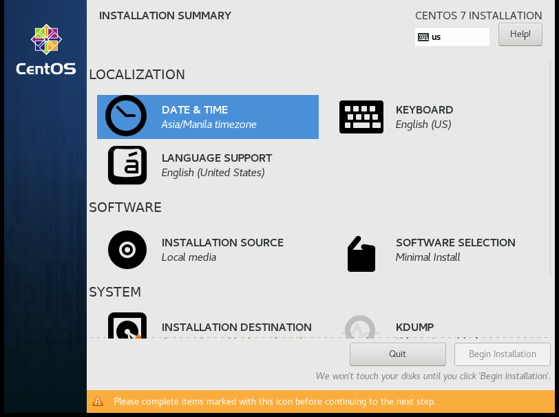

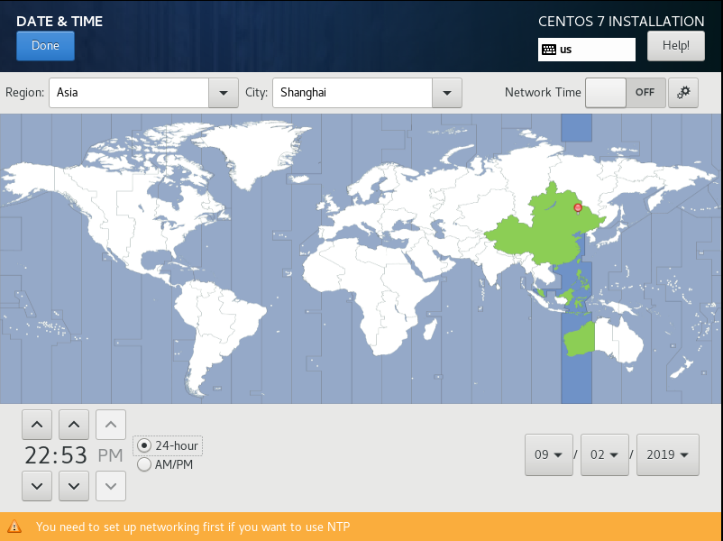

---

**step2：磁盘分区与文件系统设置**

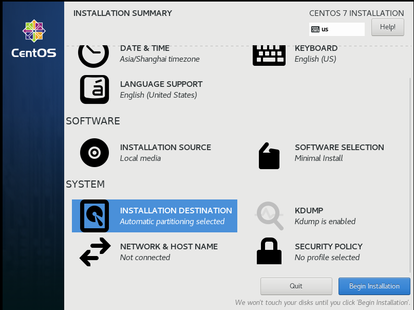

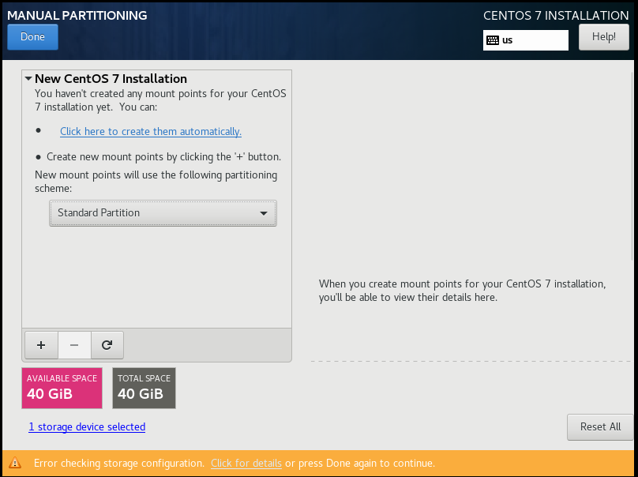

点击`+`开始建立分区
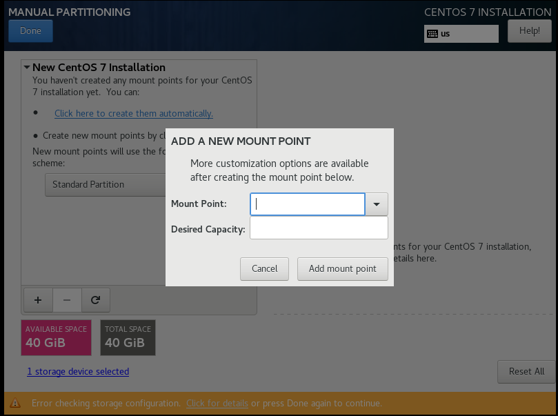

分区的设置如下
| 分区名                           | 大小           | 设备类型            | 文件类型  |
| -------------------------------- | -------------- | ------------------- | --------- |
| Bios Boot（可选，GPT分区表可用） | 2M             | Standard  Partition | BIos Boot |
| Boot                             | 1G             | Standard  Partition | xfs       |
| /                                | 10G(FIxed 30G) | LVM                 | xfs       |
| /home                            | 5G             | Standard  Partition | xfs       |
| /swap                            | 1G             | Standard  Partition | xfs       |

需要注意的是设置`/`分区时，使用了LVM管理，其设置如下

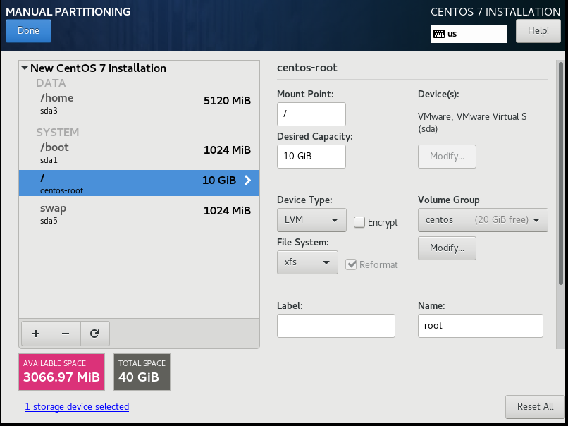

修改完设备类型为LVM后，点击Modify按钮，进行如下设置，固定大小30G

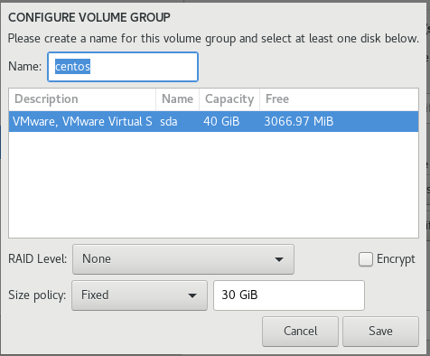

设置完毕，确认

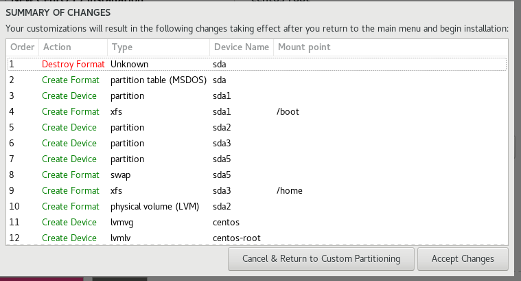

设备类型介绍

| 设备类型              | 描述                                                       |
| --------------------- | ---------------------------------------------------------- |
| Standard  Partition   | 类似 /dev/vda1 之类的分区                                  |
| LVM                   | 可以弹性增加/削减文件系统容量的设备设置,直接分配固定的容量 |
| LVM Thin Provisioning | LVM 的进阶版,使用多少容量才分配磁盘多少容量                |
| btrfs                 |                                                            |

文件类型介绍

| 文件类型       | 描述                                                         |
| -------------- | ------------------------------------------------------------ |
| ext2/ext3/ext4 | Linux早期适用的文件系统类型，ext3/ext4文件系统多了日志的记录, 对于系统的复原比较快速 |
| swap           | 磁盘仿真成为内存，并不会使用到目录树的挂载，所以不需要指定挂载点 |
| BIOS Boot      | GPT 分区表可能会使用到,若使用 MBR 分区则不需要               |
| xfs            | CentOS 默认的文件系统，对于大容量的磁、盘管理非常好,而且格式化的时候速度相当快。**主流** |
| vfat           | 同时被Linux与Windows所支持的文件系统类型，如果需要两个系统进行数据交换，可以创建一个vfat的文件系统 |

---

**step3：核心管理与网络设置**

点击进入`NETWORK & HOST NAME`选项

进行以下配置，开启`Ethernet`，设置`Host name`

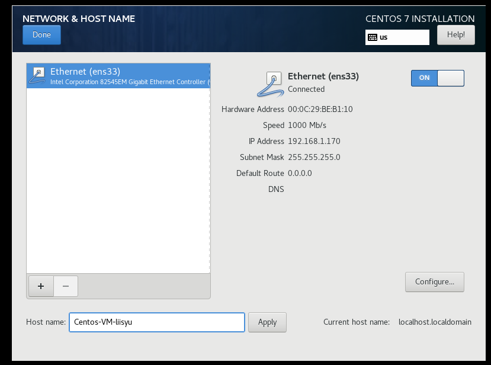

点击`Configure`开始配置

首先开始自动连接网络

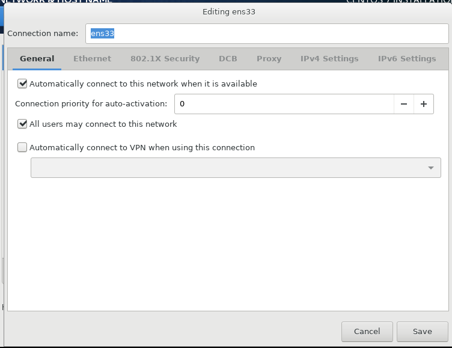

然后，手动修改网络地址

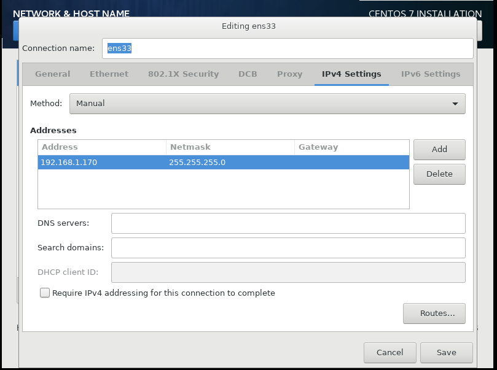

---

step4：密码设置

经过step1~3，已经配置完毕，点击安装`Centos`,在安装界面，可以对`Root`用户进行密码设定和创建新用户

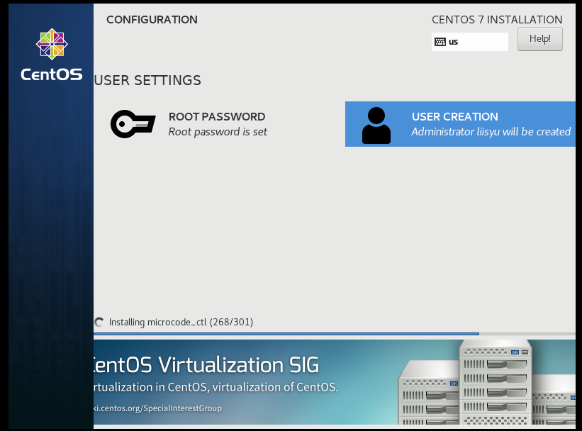

至此，安装完成

# 基础入门

## 什么是指令

指令形式如下

```shell
$ command  [-opetions] parameter1 parameter2 ...
```

说明

| 字符                   | 描述                                                         |
| ---------------------- | ------------------------------------------------------------ |
| command                | 一行指令开头必定是`command`或者可执行文件                    |
| [-opetions]            | `"[]"`表示并不存在于实际指令中，通常表示为可加入选项。<br />选项前一般会加`"-"`,如`"-h"`；也有可能加`"--"`来使用选项的完整名称,如`"--help"` |
| parameter1、parameter2 | 为**依附在**选项后面的参数,或者是 `command` 的参数           |


当按下`[Enter]`键时，指令立即执行。

当指令过长时，可以在末尾使用" \ "来跳出`[Enter]`。

**在linux系统中，区分大小写**

## 基础指令

日期与时间的指令

```shell
#显示形式： 2019年 09月 02日 星期一 16:25:49 CST
$ date  
# 显示形式：2019/09/02
$ date +%Y/%m/%d
# 显示形式16:27:22
$ date +%H:%M:%S
```

---

日历的指令

```shell
# 显示本月日历
$ cal
# 显示指定年１２个月的所有日历，如cal 2014
$ cal [year]
# 显示指定年、月的日历,如cal 10 2014
$ cal [month][year]
```

---

计算器

```shell
# 可进行简单的+、－、*、/、％(余)、^(指数)
$ bc
```

---

数据同步写入硬盘中的指令

```shell
$ sync
```

因为硬盘读写速度远低于内存，所以计算机一般都是先将数据存储到内存中，等某个时机再将数据从内存保存到硬盘中。如果发生突然的不正常关机，数据没被写到硬盘中就会损失这部分数据。

该指令可以将未被存入的数据写进硬盘中。

如果是root用户，则将所有数据进行同步。如果是非root用户，只更新自己所属数据。

---

关机指令

```shell
# 执行前最好先执行 sync指令
$ shutdown [-krhc] [时间] [警告讯息]
```

可选选项

| 选项 | 描述                                                         |
| ---- | ------------------------------------------------------------ |
| -k   | 不要真的关机,只是发送警告讯息出去!                           |
| -r   | 在将系统的服务停掉之后就重新开机(常用)                       |
| -h   | 将系统的服务停掉后,立即关机。 (常用)                         |
| -c   | 取消已经在进行的 shutdown 指令内容。                         |
| 时间 | 指定系统关机的时间!时间的范例下面会说明。若没有这个项目,则默认 1 分钟后自动进行。 |

示例

```shell
# 10分钟后关机
$ shutdown -h 10 
# 系统再过十分钟后自动关机
$ shutdown -h  +10
# 取消上一次的关机指令
$ shutdown -c
# 直接关机
$ shutdown -h now
# 指定时间关机，如果当前时间晚于指定时间，则第二天的这个时候
$ shutdown -h 20:25
# 立即重启
shutdown -r now
# 仅发出警告!系统并不会关机
shutdown -k now 'This system will reboot'
```

其他关机指令（看看就好）

```shell
# 进入系统停止的模式,屏幕可能会保留一些讯息,与电源管理模式有关
$ halt
# 进入系统关机模式
$ poweroff
```


---

重启指令

```shell
# 直接重新开机, 执行前最好先执行 sync指令
$ reboot
```

---

休眠指令

```shell
# 进入休眠模式
$ suspend
```


## 基础快捷键

| 快捷键                        | 描述                       |
| ----------------------------- | -------------------------- |
| [Tab]                         | 自动补齐<br />[Tab]接在command后面，命令补全<br />[Tab]接在第二个字段后面，文件补全 |
| [Ctrl]-d                      | 键盘输入结束，即离开命令行 |
| [Ctrl]-c                      | 指令中断 |
| [shift]+ [ PageUP ] [ Page Down ] | 向前、后翻页 |

## 帮助文档

### Help

```shell
# 显示大致用法
$ command --help
```

以下是Help用法的显示数据
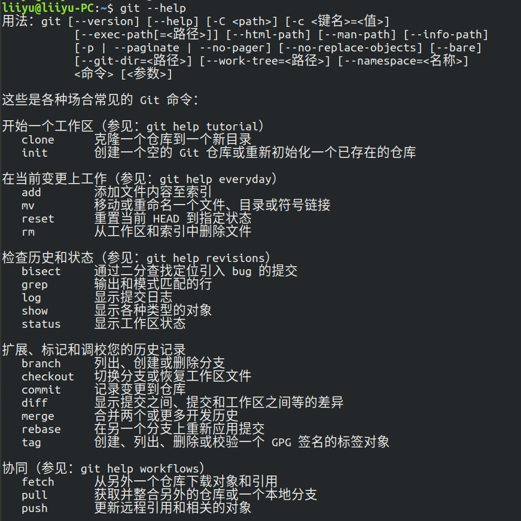


---

### Man page

```shell
# 显示详细的用法
$ man command
```

以下是`Man Page`用法的显示`git`指令数据
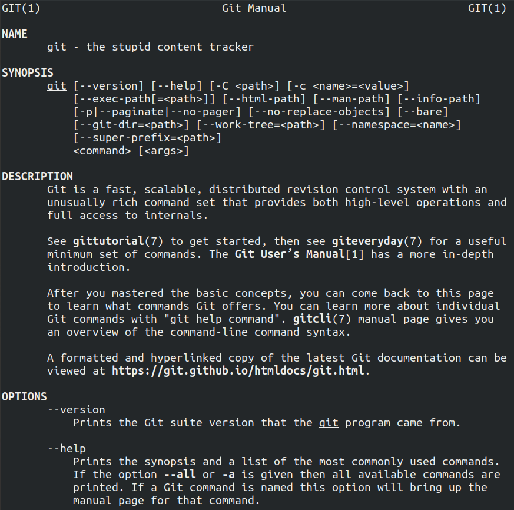

(可以通过指令`man man` 来查看显示内容代表的意义)

先来看第一行，有个`GIT(1)`，GIT就是指令，而()中的数字意义如下

| 数字          | 意义                                                         |
| ------------- | ------------------------------------------------------------ |
| **1（重要）** | 使用者在shell环境中可以操作的指令或可可执行文件              |
| 2             | 系统核心可调用的函数与工具等                                 |
| 3             | 一些常用的函数(function)与函数库(library),大部分为C的函数库(libc) |
| 4             | 设备文件的说明,通常在/dev下的文件                            |
| **5（重要）** | 配置文件或者是某些文件的格式                                 |
| 6             | 游戏(games)                                                  |
| 7             | 惯例与协定等,例如Linux文件系统、网络协定、ASCII code等等的说明 |
| **8（重要）** | 系统管理员可用的管理指令                                     |
| 9             | 跟kernel有关的文件                                           |

**标示重要的最好记住**

然后再看Man Page的内容部分，主要分为以下几个

| 代号        | 描述                                                        |
| ----------- | ----------------------------------------------------------- |
| NAME        | 简短的指令、数据名称说明                                    |
| SYNOPSIS    | 简短的指令下达语法(syntax)简介                              |
| DESCRIPTION | 较为完整的说明                                              |
| OPTIONS     | 针对 SYNOPSIS 部分中,有列举的所有可用的选项说明             |
| COMMANDS    | 当这个程序(软件)在执行的时候,可以在此程序(软件)中下达的指令 |
| FILES       | 这个程序或数据所使用或参考或链接到的某些文件                |
| SEE ALSO    | 可以参考的,跟这个指令或数据有相关的其他说明!                |
| EXAMPLE     | 一些可以参考的范例                                          |

man page 可用快捷键

| 快捷键      | 描述                                                         |
| ----------- | ------------------------------------------------------------ |
| [Page Down] | 向下翻一页                                                   |
| [Page Up]   | 向上翻一页                                                   |
| [Home]      | 去到第一页                                                   |
| [End]       | 去到最后一页                                                 |
| / string    | 向“下”搜寻 string 这个字串                                   |
| ?string     | 向“上”搜寻 string 这个字串                                   |
| n           | 如果是/ string,则继续往下查询<br />如果是?string，则继续往上查询 |
| N           | 与ｎ反向                                                     |
| q           | 结束这次的 man page                                          |

事实上，`man page`的文件存储在`/usr/share/man`目录下（一切皆文件）

如果只记得指令的部分关键字，可进行搜索`man page`

```shell
# 指令,使用-f 获取更多关于man的信息
$ man -f  man
# 结果,
$ man (1)              - 在线参考手册的接口
$ man (7)              - macros to format man pages

```

可以看到找到了两个有关man的文件，结果左边显示的是指令或文件以及它们代表的意义（那个数字），右边显示的是简要说明。而`man`指令默认会按顺序选择显示的文件，即`man man` 的话会显示`man(1)`这个文件，其与`man 1 man`效果一致。

选项`-f`匹配的是指令（显示左边部分），而如果要匹配左边和右边都行，则使用

```shell
$ man -k man
# 结果，只要左、右有一遍包含man即可
$ accessdb (8)         - 以易读的格式转储 man-db 数据库的内容
$ catman (8)           - 创建或更新预格式化的手册页
$ lexgrog (1)          - 解析 man 手册页的头部信息
$ man (1)              - 在线参考手册的接口
$ manconv (1)          - 将手册页从一种编码转换到另一种
$ mandb (8)            - 创建或更新手册页索引缓存
$ manpath (1)          - 确定手册页的搜索路径
$ manpath (5)          - 格式化 /etc/manpath.config 文件
```

### info page

info page与man page类似，主要是将内容进行分页显示，并且在各个页面中还有类似网页的“超链接”来跳到各不同的页面中。支持`info`指令的文件默认是放置`在/usr/share/info/`目录当中。**但需要查询的文档是以`Info`格式写才能使用。**

```shell
$ info command
```


